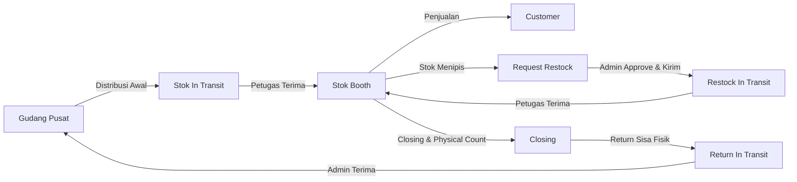
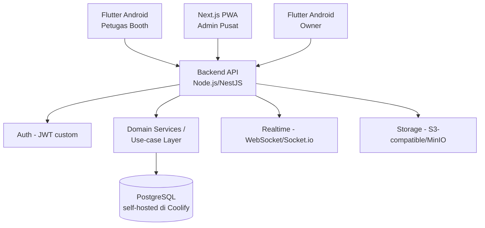
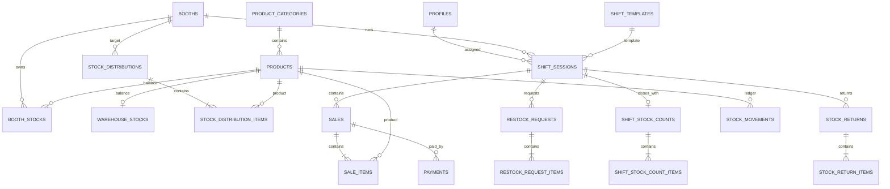
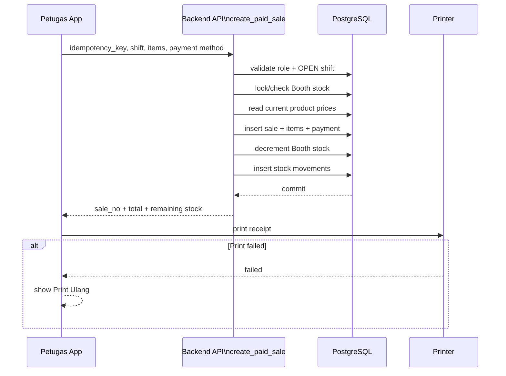
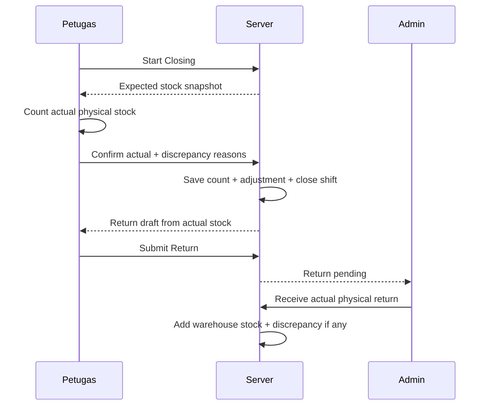
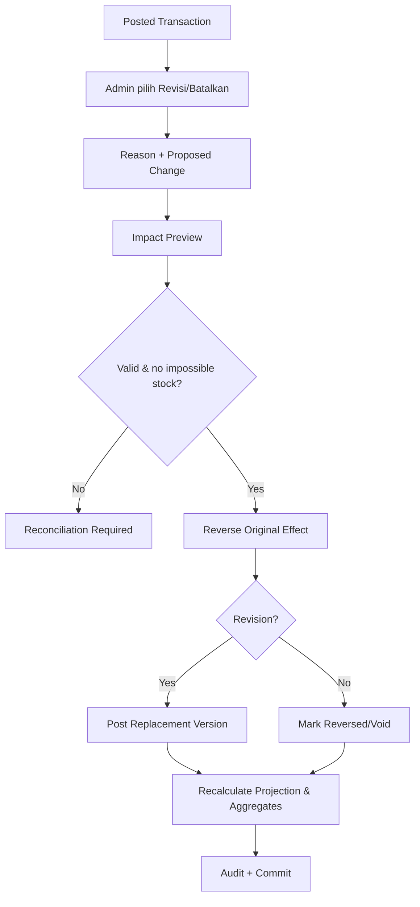
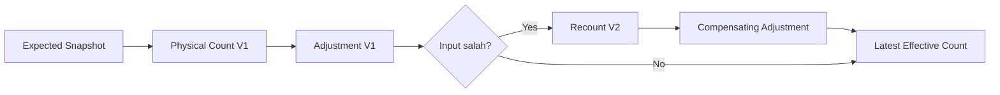

# OBBEL COFFEE & MILK — MASTER SPECIFICATION
**Version: 1.1 — Data Consistency & Correction Architecture**

> Dokumen gabungan untuk AI Coding Agent. Untuk aturan pembatalan/revisi/opname/reconciliation, `24-data-consistency-correction-reversal.md` adalah acuan normatif dan `25-transaction-impact-matrix.md` adalah quick reference.

---

# SOURCE: `AGENTS.md`

# AGENTS.md — Obbel Coffee & Milk Stock & Sales Platform

Dokumen ini adalah instruksi utama untuk AI Coding Agent. Baca seluruh berkas dokumentasi sebelum mengubah kode.

## Tujuan
Bangun satu ekosistem aplikasi untuk operasional booth keliling Obbel Coffee & Milk dengan tiga client:

1. **Android Petugas Booth** — Flutter Android native, fokus transaksi, stok, penerimaan stok, restock, dan closing shift.
2. **Web PWA Admin Pusat** — Next.js + TypeScript + Tailwind CSS, fokus distribusi stok, restock, return, monitoring, dan laporan.
3. **Android Owner** — Flutter Android native, read-only monitoring eksekutif.

Ketiganya memakai **satu backend dan satu database**.

## Keputusan arsitektur baseline
Gunakan **backend API custom (Node.js/NestJS) + PostgreSQL self-hosted di Coolify** sebagai baseline:
- PostgreSQL (Coolify managed instance) sebagai database utama.
- Backend API sendiri (NestJS/Express) menerbitkan JWT dan menangani autentikasi/session.
- Otorisasi (role & booth scoping) ditegakkan di application/service layer backend, bukan Row Level Security Postgres.
- Realtime perubahan stok/status memakai WebSocket/Socket.io (atau SSE) yang di-serve backend sendiri.
- Storage foto produk/booth memakai object storage S3-compatible (mis. MinIO) yang di-deploy di Coolify, atau disk volume terkelola.
- Transaksi stok yang harus atomik diimplementasikan sebagai service/use-case backend yang membungkus DB transaction (Prisma/Knex/raw SQL), bukan PostgreSQL Function/RPC langsung.
- Secret server-side (DB credential, JWT secret, webhook secret) hanya hidup di environment backend, tidak pernah dikirim ke client.

Jika implementasi backend diganti, pertahankan kontrak domain dan business rule dalam dokumentasi.

## Prinsip wajib
- **DATA CONSISTENCY IS P0:** setiap posted transaction harus mempunyai aturan cancel/reversal dan revision; tidak boleh direct edit/hard delete.
- Baca dan patuhi `24-data-consistency-correction-reversal.md` sebelum membangun mutation transaksi. Gunakan `25-transaction-impact-matrix.md` sebagai quick reference per transaksi.
- Jangan hardcode booth, shift, produk, harga, threshold stok, atau user.
- Jangan mengubah stok hanya dengan `UPDATE qty` dari UI. Semua perubahan stok harus melewati service/domain-layer backend yang atomik dan membuat `stock_movements`.
- Gunakan UUID dan idempotency key untuk transaksi kritis.
- Semua nominal uang disimpan sebagai integer Rupiah, bukan float.
- Semua kuantitas unit cup disimpan sebagai integer.
- Semua timestamp disimpan UTC; UI menampilkan Asia/Jakarta.
- Owner read-only.
- Petugas Booth hanya boleh mengakses booth/shift yang ditugaskan kepadanya.
- Admin Pusat dapat menjalankan aksi operasional lintas booth.
- Gunakan Bahasa Indonesia pada UI.
- UX: banyak klik/tap, minim ketikan, angka penting besar, satu layar satu tujuan utama.

## Urutan implementasi yang disarankan
1. Database, enum, constraint, index, authorization/role & booth-scoping layer di backend.
2. Seed master data.
3. Immutable stock ledger + transaction lineage/version foundation.
4. RPC/domain service transaksi normal **dan correction/reversal/revision**.
5. Stock opname, recount, adjustment, reconciliation engine, dan integrity tests.
6. Auth + role guard.
7. Flutter Petugas Booth.
8. Web PWA Admin Pusat termasuk Riwayat & Koreksi Data.
9. Flutter Owner.
10. Realtime, printer adapter, notification, export.
11. Testing end-to-end seluruh normal flow + correction flow.

## Definition of Done
Fitur dianggap selesai hanya jika:
- UI sesuai role dan flow.
- Business rule tervalidasi di backend, bukan hanya UI.
- Ada loading, empty, error, dan success state.
- Aksi tidak menyebabkan duplikasi ketika tombol ditekan dua kali.
- Perubahan stok menghasilkan ledger `stock_movements`.
- Revisi/cancel transaksi posted memakai reversal/replacement dan audit trail.
- Stock opname confirmed immutable; correction menggunakan recount.
- Report/dashboard membaca effective/net data setelah correction.
- Permission/authorization layer diuji.
- Acceptance criteria terkait lulus.

---

# SOURCE: `00-README.md`

# Dokumentasi Project — Obbel Coffee & Milk
## Stock, Sales & Booth Monitoring Platform

Versi dokumentasi: **1.1 — Data Consistency & Correction Architecture**  
Tujuan dokumen: dasar implementasi oleh **AI Coding Agent / developer** tanpa perlu mengetahui percakapan awal project.

---

## 1. Ringkasan

Project ini menggantikan pencatatan operasional booth keliling yang berpotensi tercecer dengan sistem terpusat. Sistem harus bisa menjawab secara real-time:

- stok Gudang Pusat sekarang berapa;
- stok masing-masing Booth sekarang berapa;
- stok apa yang sedang dikirim dan belum diterima;
- penjualan per Booth/shift/produk;
- Booth yang stoknya menipis;
- permintaan restock yang harus ditindaklanjuti;
- sisa stok saat closing;
- stok yang dikembalikan ke Gudang;
- selisih stok sistem vs fisik;
- performa bisnis yang perlu dilihat Owner.

Produk yang dilacak pada scope V1 adalah **produk siap jual dalam satuan cup**, bukan bahan baku resep seperti kopi bubuk, susu, gula, es, dan sebagainya.

---

## 2. Aplikasi dalam ekosistem

| App | Platform | Pengguna | Karakter |
|---|---|---|---|
| Petugas Booth | Flutter Android native | Petugas Booth | Operasional cepat, POS, stok, shift |
| Admin Pusat | Next.js Web PWA | Admin/Gudang | Control center seluruh Booth |
| Owner | Flutter Android native | Owner/Manager | Monitoring read-only |

Semua client memakai **satu database/backend**.

---

## 3. Dokumen

1. `01-project-overview.md` — tujuan, scope, terminology, asumsi.
2. `02-system-architecture.md` — arsitektur teknis dan pembagian komponen.
3. `03-users-roles-permissions.md` — role dan matriks akses.
4. `04-user-flow.md` — alur end-to-end per role.
5. `05-feature-specification.md` — spesifikasi halaman dan fitur.
6. `06-ui-ux-guideline.md` — pedoman desain dan interaksi.
7. `07-database-schema.md` — tabel, field, relasi, index, constraint.
8. `08-business-rules.md` — aturan bisnis dan rumus stok.
9. `09-api-rpc-contract.md` — kontrak service/RPC.
10. `10-state-machines.md` — status lifecycle transaksi.
11. `11-notification-printing-offline.md` — notifikasi, printer, network behavior.
12. `12-reporting-dashboard.md` — definisi KPI dan laporan.
13. `13-security-audit.md` — Auth, RLS, audit, keamanan.
14. `14-development-guideline.md` — struktur project dan coding convention.
15. `15-testing-acceptance-criteria.md` — test case dan kriteria penerimaan.
16. `16-seed-dummy-data.md` — data contoh dari materi Obbel.
17. `17-deployment-environment.md` — environment dan deployment.
18. `18-ai-agent-implementation-plan.md` — urutan eksekusi agent.
19. `19-requirement-traceability.md` — pemetaan kebutuhan ke fitur/data/test.
20. `20-starter-schema.sql` — starter SQL referensi.
21. `21-screen-route-map.md` — route/screen map.
22. `22-mermaid-diagrams.md` — diagram alur dan ERD.
23. `23-open-decisions.md` — keputusan yang harus dikonfirmasi sebelum production.
24. `24-data-consistency-correction-reversal.md` — aturan cancel/revisi, stock opname, correction, reversal, dan reconciliation seluruh transaksi.
25. `25-transaction-impact-matrix.md` — quick reference dampak cancel/revisi per jenis transaksi.

Folder `references/` berisi mockup dan referensi visual yang harus dipakai sebagai arah desain, bukan sebagai pixel-perfect requirement.

---

## 4. Keputusan yang sengaja dibuat configurable

Beberapa informasi dari brief tidak konsisten atau dapat berubah di operasional, sehingga **dilarang hardcode**:

- jam Shift 1 dan Shift 2;
- jumlah Booth;
- jumlah Petugas;
- minimum stok per produk per Booth;
- harga produk;
- lokasi Booth;
- printer thermal yang digunakan.

Semua harus berasal dari master/configuration data.

---

## 5. Prioritas MVP

### P0 — wajib sebelum dipakai
- Login dan role.
- Master Booth, Produk, Shift, User.
- Stok Gudang & Stok Booth.
- Distribusi stok Gudang → Booth.
- Penerimaan stok oleh Petugas.
- POS/penjualan dan pembayaran Tunai/QRIS.
- Stock deduction atomik.
- Warning stok menipis.
- Request & fulfillment restock.
- Closing shift + physical count.
- Return Booth → Gudang.
- Dashboard Admin.
- Dashboard Owner.
- Laporan dasar.
- Audit stock movement.
- Correction/reversal transaction engine.
- Stock opname Gudang & Booth.
- Recount dan reconciliation historis.
- Riwayat versi transaksi dan impact preview koreksi.

### P1 — sesudah P0 stabil
- Bluetooth thermal printer production integration.
- Push notification native Android.
- Export Excel/PDF yang lebih kaya.
- Offline sales queue bila dibutuhkan di lapangan.
- Foto bukti/attachment bila dibutuhkan.

### Out of scope V1
- Akuntansi lengkap.
- Payroll.
- Purchase order supplier.
- Raw material recipe/BOM.
- CRM/loyalty.
- Marketplace/order customer.
- Instagram integration.

---

# SOURCE: `01-project-overview.md`

# 01 — Project Overview

## 1. Nama Project
**Obbel Coffee & Milk — Stock, Sales & Booth Monitoring Platform**

## 2. Problem Statement
Obbel menjalankan penjualan melalui Booth keliling. Setiap Booth membawa stok produk siap jual, melakukan transaksi sepanjang shift, dapat menerima restock, lalu mengembalikan sisa stok ketika shift selesai.

Tanpa sistem terpusat, risiko yang muncul:
- stok Gudang dan Booth tidak sinkron;
- pusat terlambat tahu produk hampir habis;
- restock tidak memiliki jejak yang jelas;
- penjualan dan stok fisik sulit dicocokkan;
- selisih stok diketahui terlambat;
- Owner tidak punya satu dashboard ringkas untuk melihat kondisi bisnis.

## 3. Objective
Sistem harus membuat proses berikut dapat dilacak end-to-end:

**Gudang → Distribusi → Booth → Penjualan → Restock → Closing → Return → Gudang**

Dengan target:
- transaksi Petugas sangat cepat;
- stok dapat dipantau secara real-time;
- setiap perpindahan stok memiliki audit trail;
- pusat memperoleh early warning;
- Owner dapat melihat performa tanpa ikut mengubah data operasional.

## 4. Pengguna

### 4.1 Petugas Booth
Menggunakan Android Flutter. Fokus pada aksi cepat saat melayani pembeli.

### 4.2 Admin Pusat / Gudang
Menggunakan Web PWA. Fokus pada kontrol stok dan operasional seluruh Booth.

### 4.3 Owner / Manager
Menggunakan Android Flutter. Fokus pada monitoring dan analisa read-only.

## 5. Konsep satuan stok
Untuk V1, stok produk dinyatakan dalam **cup**.

Contoh:
- Matcha: 10 cup
- Brown Sugar: 8 cup

Tidak ada perhitungan bahan baku/resep dalam V1.

## 6. Terminologi resmi

| Istilah | Definisi |
|---|---|
| Gudang Pusat | Lokasi stok utama sebelum dialokasikan ke Booth |
| Booth | Titik/gerobak penjualan |
| Petugas Booth | User yang bertugas pada Booth dalam suatu shift |
| Shift | Periode kerja yang configurable |
| Distribusi | Pengiriman stok awal dari Gudang ke Booth |
| Restock | Tambahan stok ke Booth di tengah operasional |
| Return | Pengembalian sisa stok dari Booth ke Gudang |
| Expected Stock | Stok menurut sistem |
| Actual Stock | Hasil hitung fisik saat closing |
| Discrepancy/Selisih | Actual Stock - Expected Stock |
| Stock Movement | Ledger immutable setiap perpindahan/perubahan stok |

## 7. Non-functional requirements
- UI Bahasa Indonesia.
- Responsive untuk Admin Web.
- Android minimum target ditentukan saat setup Flutter; hindari API eksperimental tanpa kebutuhan.
- Semua aksi kritis harus idempotent.
- Perubahan stok harus atomik.
- Waktu transaksi presisi dan dapat diaudit.
- Data Owner read-only.
- Aplikasi tetap mudah dipakai user non-teknis.

## 8. UX north star
Petugas seharusnya dapat menyelesaikan transaksi penjualan normal dengan pola:

**Tap Produk → Pilih Pembayaran → Bayar & Print**

Target aksi normal: **2–4 tap**, di luar pemilihan banyak item.

Admin seharusnya dapat restock dengan:

**Klik Request → Setujui Jumlah → Kirim**

Owner seharusnya dapat memahami kondisi harian dari layar pertama tanpa membuka laporan kompleks.

## 9. Referensi visual
Gunakan folder `references/`:
- mockup Android Petugas Booth;
- mockup Web Admin Pusat;
- mockup Android Owner;
- referensi Instagram, menu, dan lokasi Obbel.

Brand utama: hijau Obbel + putih, dengan kuning/merah hanya untuk warning/error.

## Data consistency sebagai requirement P0

Konsistensi data adalah kebutuhan inti, bukan fitur tambahan. Sistem harus menerima kenyataan bahwa manusia dapat salah input dan transaksi dapat perlu dibatalkan atau direvisi.

Aturan project:
- transaksi posted tidak hard-delete;
- transaksi posted tidak diedit langsung;
- cancel menggunakan reversal;
- revision menggunakan reverse + replacement;
- stok opname menggunakan physical count + adjustment ledger;
- correction historis otomatis merestate stok, omzet, penjualan, payment, shift, discrepancy, return, dan laporan yang terdampak;
- seluruh correction dapat diaudit.

Spesifikasi normatif ada pada `24-data-consistency-correction-reversal.md`.

---

# SOURCE: `02-system-architecture.md`

# 02 — System Architecture

## 1. High-level architecture

```text
Flutter Android — Petugas Booth ─┐
                                 │
Next.js PWA — Admin Pusat ───────┼── Backend API (Node.js/NestJS)
                                 │   ├─ Auth (JWT custom)
Flutter Android — Owner ─────────┘   ├─ PostgreSQL (Coolify, self-hosted)
                                     ├─ Domain Services / Use-case layer
                                     ├─ Realtime (WebSocket/Socket.io)
                                     └─ Storage (S3-compatible/MinIO, opsional)
```

## 2. Alasan baseline Backend API custom + PostgreSQL di Coolify
- PostgreSQL cocok untuk transaksi stok dan relasi kuat, dan dapat di-hosting sendiri di Coolify tanpa vendor lock-in.
- Otorisasi (Booth Staff hanya ke Booth-nya) ditegakkan secara eksplisit di service/application layer backend.
- Realtime (WebSocket/Socket.io) yang di-serve backend sendiri memudahkan Admin melihat perubahan stok/status.
- Flutter dan Next.js memiliki HTTP client/SDK yang matang untuk mengonsumsi REST/GraphQL API backend.
- Domain service backend memungkinkan operasi stok atomik (DB transaction) tanpa bergantung pada platform BaaS pihak ketiga.

## 3. Client architecture

### 3.1 Flutter Petugas Booth
Layer:
```text
Presentation / Screens
  ↓
State Management
  ↓
Use Cases / Application Services
  ↓
Repository Interfaces
  ↓
Backend API Repository (HTTP/REST)
  ↓
Local Cache / Printer Adapter
```

Rekomendasi state management: Riverpod atau Bloc. Pilih satu dan konsisten. Jangan campur beberapa framework state tanpa alasan.

### 3.2 Admin PWA
Next.js App Router + TypeScript + Tailwind.

Layer:
```text
app/routes
components
features
services/repositories
lib/api-client
schemas
```

Data mutation wajib server-side/RPC untuk aksi stok kritis. UI tidak boleh mengatur stok dengan update langsung.

### 3.3 Flutter Owner
Arsitektur serupa Petugas tetapi repository hanya expose query/read operation dan export/download bila diperlukan.

## 4. Backend responsibility
Backend harus menjadi sumber kebenaran untuk:
- permission;
- current stock;
- validation status;
- price snapshot saat penjualan;
- movement ledger;
- shift status;
- discrepancy;
- idempotency.

Jangan percaya nilai total, role, booth_id, atau stock balance yang dikirim client tanpa validasi server.

## 5. Transaction boundaries
Operasi berikut harus terjadi dalam satu DB transaction:
- menerima distribusi;
- membuat sale dan mengurangi stok;
- menerima restock;
- menerima return dan memindahkan stok;
- stock adjustment;
- finalisasi closing bila menghasilkan discrepancy record.

Jika salah satu langkah gagal, seluruh operasi rollback.

## 6. Realtime channel
Subscribe hanya pada data yang diperlukan:

### Petugas
- distribusi untuk Booth aktif;
- restock untuk Booth aktif;
- perubahan shift sendiri bila diubah admin.

### Admin
- restock request;
- stock return pending;
- booth stock threshold alert;
- status distribusi.

### Owner
Realtime boleh digunakan untuk KPI ringkas, tetapi polling/pull-to-refresh juga diterima. Hindari subscribe seluruh tabel transaksi mentah bila tidak perlu.

## 7. Time & timezone
- DB: `timestamptz` UTC.
- UI: `Asia/Jakarta`.
- Laporan harian dikelompokkan berdasarkan tanggal lokal Asia/Jakarta.

## 8. Money
Simpan Rupiah sebagai integer/bigint.

Benar:
```text
10000
```

Jangan:
```text
10000.00 float
```

## 9. Quantity
Stok V1 integer cup. Tidak ada fractional cup.

## 10. Future-proofing
Arsitektur harus memungkinkan nanti:
- raw material inventory;
- multi warehouse;
- multiple payment methods;
- promo/discount;
- customer order;
- multi-company.

Tetapi jangan mengimplementasikan fitur itu di V1 kecuali diperlukan oleh struktur data generik yang sederhana.

## Correction & Reconciliation Domain

Tambahkan domain service khusus **Correction & Reconciliation** di backend. Client tidak mengimplementasikan logika reversal sendiri.

Alur mutation correction:

```text
Client
  → Correction API/RPC
  → authorization + current state validation
  → impact preview / dependency check
  → reversal original effect
  → replacement/correction posting
  → stock & payment projection update
  → aggregate/reconciliation recalculation
  → audit log
  → commit atomik
```

`stock_movements` tetap append-only. `warehouse_stocks` dan `booth_stocks` adalah projection yang harus bisa diverifikasi/rebuild dari ledger.

---

# SOURCE: `03-users-roles-permissions.md`

# 03 — Users, Roles & Permissions

## 1. Role
Gunakan enum konseptual:
- `BOOTH_STAFF`
- `ADMIN`
- `OWNER`

Jika nanti ada role Runner/Kurir, tambahkan sebagai fase berikutnya; jangan implementasikan sekarang.

## 2. BOOTH_STAFF
### Boleh
- login;
- melihat profil sendiri;
- melihat Booth dan shift assignment aktif;
- melihat master produk aktif dan harga;
- melihat stock Booth sendiri;
- menerima distribusi yang ditujukan ke Booth/shift sendiri;
- membuat sale untuk Booth/shift sendiri;
- melihat/print ulang transaksi shift sendiri;
- membuat restock request;
- menerima restock untuk Booth sendiri;
- memulai/tutup shift sesuai rule;
- menginput actual count pada closing;
- membuat return setelah closing;
- melihat ringkasan shift sendiri.

### Tidak boleh
- melihat data Booth lain;
- mengubah harga;
- mengubah master produk;
- menambah stok langsung;
- approve restock sendiri;
- menerima return ke Gudang;
- koreksi movement ledger;
- melihat dashboard Owner global.

## 3. ADMIN
### Boleh
- semua data operasional lintas Booth;
- manage product, Booth, shift template, user assignment;
- melihat dan mengatur warehouse stock melalui movement resmi;
- membuat distribusi;
- approve/reject restock;
- mengirim restock;
- menerima return;
- melakukan adjustment dengan alasan wajib;
- melihat sale dan laporan;
- export laporan.

### Tidak boleh
- menghapus stock movement yang sudah posted;
- mengubah transaksi paid secara sembarang tanpa void/reversal flow;
- bypass audit log.

## 4. OWNER
### Boleh
- membaca KPI global;
- ranking Booth;
- detail Booth;
- sales analytics;
- stock condition;
- discrepancy;
- laporan dan export read-only.

### Tidak boleh
- create/update/delete data operasional;
- distribusi;
- restock approval;
- return acceptance;
- adjustment;
- mengedit user/master.

## 5. Matriks permission

| Aksi | Booth Staff | Admin | Owner |
|---|:---:|:---:|:---:|
| View produk aktif | ✓ | ✓ | ✓ |
| Create sale | ✓ own booth | ✓ optional | ✗ |
| Receive initial stock | ✓ own booth | ✓ override audited | ✗ |
| Request restock | ✓ own booth | ✓ | ✗ |
| Approve restock | ✗ | ✓ | ✗ |
| Receive restock | ✓ own booth | ✓ override | ✗ |
| Close shift | ✓ assigned | ✓ override | ✗ |
| Return stock | ✓ submit | ✓ receive | ✗ |
| Stock adjustment | ✗ | ✓ | ✗ |
| Edit master | ✗ | ✓ | ✗ |
| Global report | ✗ | ✓ | ✓ read-only |
| View discrepancy | own shift | ✓ | ✓ |

## 6. Assignment rules
`profiles.booth_id` boleh dipakai sebagai default Booth untuk user tetap, tetapi assignment aktual harus diambil dari `shift_sessions.staff_id` + `booth_id` agar mendukung perpindahan petugas.

## 7. RLS intent
Policy minimal:
- Booth Staff: rows scoped by booth yang ditugaskan/shift aktif.
- Admin: operational CRUD sesuai tabel.
- Owner: SELECT only pada view/table reporting yang diizinkan.

Jangan mengandalkan hidden button sebagai security.

## Permission koreksi data

### BOOTH_STAFF
Hanya dapat mengubah data sebelum confirmation/posting sesuai lifecycle: cart, qty penerimaan sebelum receive, restock request REQUESTED, closing count DRAFT, return DRAFT. Tidak dapat void/revise transaksi posted.

### ADMIN
Mempunyai permission correction posted transaction melalui flow terkontrol: reason wajib, impact preview, reversal/replacement, dan audit. Admin juga menjalankan stock opname, recount, dan reconciliation.

### OWNER
Read-only terhadap correction. Owner dapat melihat nilai effective terbaru dan audit/indikator data direvisi, tetapi tidak dapat melakukan mutation.

---

# SOURCE: `04-user-flow.md`

# 04 — User Flow

## A. Flow Petugas Booth — Hari Kerja

```text
Login
→ Sistem menentukan assignment Booth + Shift
→ Lihat Beranda
→ Bila ada distribusi pending: Lihat & Terima Stok
→ Shift aktif
→ Jual produk sepanjang shift
→ Jika stok rendah: Minta Restock
→ Jika restock dikirim: Terima Restock
→ Menjelang selesai: Tutup Shift
→ Hitung stok fisik
→ Sistem hitung selisih
→ Konfirmasi Closing
→ Ajukan Return Sisa Stok
→ Menunggu Admin menerima Return
→ Selesai
```

### A1. Login
1. User input username/password.
2. Auth sukses.
3. Sistem resolve role `BOOTH_STAFF`.
4. Sistem cari shift assignment hari ini.
5. Jika belum ada assignment, tampilkan empty state dan kontak Admin; jangan biarkan membuat sale tanpa Booth/shift.

### A2. Receive initial distribution
1. Beranda menampilkan card “Ada Stok Masuk”.
2. Petugas tap.
3. Lihat detail product + qty.
4. Petugas cek fisik.
5. Jika sesuai → `Terima`.
6. Jika tidak sesuai → `Laporkan Selisih` dan isi qty aktual dengan stepper.
7. Backend memindahkan qty dari in-transit menjadi Booth stock sesuai rule yang dipilih Admin pada discrepancy handling.

### A3. Sale
1. Tap menu Jual.
2. Tap product card.
3. Qty default +1 setiap tap; cart dapat diedit dengan +/-.
4. Tap cart.
5. Pilih Tunai atau QRIS.
6. Tap `Bayar & Print Nota`.
7. Backend validasi stock dan shift.
8. Jika sukses, sale `PAID`, stock berkurang, movement tercatat.
9. Print receipt bila printer tersedia.

### A4. Restock request
1. Petugas melihat warning.
2. Tap `Minta Restock`.
3. Pilih product.
4. Pilih quick qty 5/10/15/20 atau +/-.
5. Submit.
6. Status `REQUESTED`.
7. Admin menindaklanjuti.

### A5. Receive restock
1. Notifikasi restock telah dikirim.
2. Petugas buka detail.
3. Cek fisik.
4. Tap Terima.
5. Stock Booth bertambah atomik.

### A6. Closing
1. Tap `Tutup Shift`.
2. Sistem freeze/lock normal sale pada titik final confirmation; sebelum itu Petugas dapat kembali.
3. Sistem tampilkan expected stock per produk.
4. Petugas hitung actual dan input dengan +/-.
5. Sistem hitung discrepancy.
6. Untuk item selisih, alasan wajib dipilih.
7. Confirm closing.
8. Sistem membuat stock count/discrepancy records.
9. Sistem menyiapkan return qty = actual stock yang masih ada di Booth.

### A7. Return
1. Petugas review return.
2. Submit `Kembalikan Stok`.
3. Return status `SUBMITTED`/`IN_TRANSIT`.
4. Booth stock diperlakukan locked/in transit sesuai implementasi.
5. Admin menerima fisik.
6. Saat Admin confirm, warehouse stock bertambah.

---

## B. Flow Admin Pusat

```text
Login
→ Dashboard Pusat
→ Siapkan distribusi awal
→ Kirim stok ke Booth
→ Pantau receipt
→ Pantau sale & stock
→ Tindaklanjuti low-stock / restock request
→ Kirim restock
→ Pantau closing
→ Terima return
→ Investigasi discrepancy
→ Laporan
```

### B1. Distribusi
1. Klik Booth card.
2. Pilih produk.
3. Qty via quick buttons/stepper.
4. Review summary.
5. Kirim.
6. Warehouse available stock berkurang/di-reserve sesuai status model; lihat business rule.
7. Petugas menerima.

### B2. Restock
1. Dashboard menampilkan request.
2. Klik request.
3. Cek stock Gudang.
4. Setujui qty.
5. Status prepared/sent.
6. Petugas receive.

### B3. Return
1. Admin melihat return pending.
2. Cocokkan fisik dengan submitted return.
3. Jika sama → Receive.
4. Jika berbeda → masukkan actual received dan alasan/discrepancy.
5. Warehouse stock bertambah actual received.

---

## C. Flow Owner

```text
Login
→ Dashboard Executive
→ Lihat omzet/cup/booth aktif/alert
→ Tap alert atau ranking
→ Drill down Booth / produk / stock / discrepancy
→ Laporan
```

Tidak ada mutation operasional.

## Flow Admin — Koreksi Data

```text
Cari transaksi
→ buka Detail
→ Lihat Riwayat Versi
→ klik Revisi / Batalkan
→ pilih reason
→ ubah data menggunakan click/+/-
→ backend Impact Preview
→ tampilkan dampak stok/omzet/payment/shift/return
→ Admin Konfirmasi
→ backend reversal + replacement/correction atomik
→ reconciliation
→ success + nomor correction
```

## Flow Admin — Stock Opname

```text
Pilih Gudang/Booth
→ snapshot expected stock
→ input physical count
→ review selisih
→ pilih reason bila ada selisih
→ confirm
→ adjustment movement
→ update stock projection
→ discrepancy report
```

Confirmed opname tidak diedit. Bila salah hitung/input, gunakan Recount/Revision.

---

# SOURCE: `05-feature-specification.md`

# 05 — Feature Specification

# A. Flutter Android — Petugas Booth

## A1. Login
Komponen:
- logo;
- username;
- password;
- show/hide password;
- remember session;
- login button;
- error state.

Acceptance UX: tombol login penuh, field minimum, tidak ada konfigurasi teknis.

## A2. Bottom Navigation
Empat tab tetap:
1. Beranda
2. Jual
3. Stok
4. Shift

Badge dapat muncul di Beranda/Stok ketika ada inbound/restock.

## A3. Beranda
Wajib menampilkan:
- nama Petugas;
- nama Booth;
- status shift;
- jam shift;
- omzet shift/hari sesuai label;
- cup sold;
- transaksi;
- jumlah item low stock;
- pending stock inbound card;
- alert penting.

Prioritas card inbound > KPI biasa jika ada stok belum diterima.

## A4. Terima Stok
- source Gudang;
- target Booth;
- shift;
- timestamp sent;
- item list;
- total cup;
- button receive;
- discrepancy action.

Harus ada confirmation state dan protection double-tap.

## A5. POS
- search product;
- category chips;
- product grid;
- image optional;
- name, price, current stock;
- disabled/sold-out state;
- sticky cart.

Product card stok kritis boleh menunjukkan badge, tetapi tetap bisa dijual jika qty > 0.

## A6. Cart & Payment
- item list;
- +/-;
- subtotal;
- total;
- method Tunai/QRIS;
- Pay & Print;
- success state;
- reprint.

V1 tidak membutuhkan split payment.

## A7. Stok
- current stock per product;
- minimum threshold;
- status Aman/Menipis/Habis;
- request restock;
- inbound restock card;
- stock movement ringkas optional.

## A8. Restock Request
- select multiple products;
- requested qty;
- optional note dengan preset reason terlebih dahulu;
- submit;
- status timeline.

## A9. Shift
- current shift summary;
- omzet;
- sold qty;
- transaction count;
- stock remaining;
- product summary;
- close shift.

## A10. Closing Count
- expected quantity;
- actual quantity;
- discrepancy live;
- reason chips;
- optional note if Other;
- confirm.

## A11. Return
- return item summary;
- total;
- submit;
- pending received status.

---

# B. Web PWA — Admin Pusat

## B1. Dashboard
KPI:
- omzet hari ini;
- cup terjual;
- Booth aktif;
- item menipis;
- pending restock;
- pending return;
- discrepancy alert.

Grid Booth:
- status;
- shift;
- omzet;
- remaining stock;
- quick action.

Notification panel harus actionable.

## B2. Distribusi Stok
Wizard:
- Booth → Products → Qty → Confirm.

Harus menunjukkan warehouse available qty dan mencegah over-allocation.

## B3. Restock Booth
- status tabs;
- booth filter;
- priority;
- current Booth stock;
- warehouse available;
- requested vs approved qty;
- approve/reject/send.

## B4. Return Stok
- pending return list;
- detail submitted vs actual received;
- discrepancy;
- receive;
- bulk receive hanya untuk item yang cocok dan eligible.

## B5. Monitor Stok Booth
Matrix table desktop:
- rows products;
- columns Booth atau sebaliknya;
- filter;
- threshold badge;
- quick restock.

Untuk layar kecil PWA, ubah menjadi stacked cards, jangan paksa tabel horizontal besar.

## B6. Warehouse Stock
- on hand;
- reserved/in transit bila digunakan;
- available;
- status;
- movement history;
- adjustment dengan alasan.

## B7. Sales
- transaction list;
- detail receipt;
- filter period, Booth, product, payment method;
- summary.

## B8. Reports
- sales summary;
- Booth ranking;
- product ranking;
- shift report;
- movement ledger;
- return;
- discrepancy;
- export.

## B9. Master Data
Product:
- name, category, price, image, active.

Booth:
- code, name, location, active.

Stock threshold:
- Booth/product min and critical.

Shift template:
- name, start, end.

User:
- profile, role, assignment/default Booth, active.

---

# C. Flutter Android — Owner

## C1. Login
Simple owner access.

## C2. Executive Home
- omzet today;
- delta vs previous comparable period;
- cup sold;
- active Booth;
- attention count;
- alert cards;
- best Booth.

## C3. Booth Ranking
Period chips:
- Hari Ini
- 7 Hari
- Bulan Ini

List ranking with omzet and cup.

## C4. Booth Detail
- status;
- omzet;
- cup sold;
- transactions;
- stock remaining;
- top products;
- shift summaries;
- read-only stock detail.

## C5. Sales Analytics
- total omzet;
- simple chart;
- top product;
- top Booth.

## C6. Stock Condition
- %/count safe;
- low count;
- out count;
- list only problem items first.

## C7. Discrepancy
- qty discrepancy;
- estimated value;
- Booth list;
- detail reason.

## C8. Reports
Card-based navigation and period chips. Export optional but recommended.

## B10. Riwayat & Koreksi Data
- global search nomor transaksi;
- filter jenis transaksi, Booth, tanggal, Petugas, status;
- transaction detail;
- version/revision timeline;
- audit trail;
- impact preview;
- action `Revisi Transaksi` dan `Batalkan Transaksi` berdasarkan eligibility;
- reason wajib;
- warning post-close correction;
- status reconciliation.

Jangan gunakan tombol `Edit` biasa untuk posted transaction.

## B11. Stock Opname
- pilih location Gudang/Booth menggunakan card;
- snapshot expected stock;
- physical count menggunakan +/-;
- live discrepancy;
- reason chip;
- confirm opname;
- recount/revision bila confirmed count salah;
- movement/adjustment audit.

## B12. Adjustment / Koreksi Stok
Admin memilih location + product + target actual quantity. Server menghitung delta. Reason wajib. Posted adjustment hanya dapat diperbaiki melalui reversal adjustment.

---

# SOURCE: `06-ui-ux-guideline.md`

# 06 — UI/UX Guideline

## 1. Brand direction
- Primary: hijau Obbel.
- Background: putih / off-white.
- Neutral: abu muda.
- Success: hijau.
- Warning: amber/kuning.
- Critical/Error: merah.

Exact hex dapat diturunkan dari logo/design token saat asset final tersedia. Jangan mengambil warna berbeda-beda di setiap screen.

## 2. Design language
- clean;
- modern;
- sederhana;
- rounded card;
- border tipis atau shadow sangat ringan;
- whitespace cukup;
- hindari visual overload.

## 3. Typography hierarchy
Contoh mobile:
- KPI utama: 28–36sp, bold.
- Total bayar: 32–40sp, bold.
- Section title: 18–22sp, semibold.
- Card title: 15–17sp.
- Body: 14–16sp.
- Caption: 12–13sp.

Desktop dapat scale sesuai responsive design.

Rule: font besar harus dipakai karena informasi penting, bukan sekadar dekoratif.

## 4. Interaction principle — “banyak klik, minim ketik”
Prioritaskan:
- product card;
- segmented control;
- chip;
- +/- stepper;
- quick quantity 5/10/15/20;
- toggle;
- date preset;
- bottom navigation;
- clickable row/card;
- drawer detail.

Hindari:
- dropdown panjang bila data dapat tampil sebagai card;
- field qty bebas;
- form multi-field untuk aksi yang seharusnya sederhana;
- tabel padat pada Android.

## 5. Android Petugas
### Layout
- Portrait-first.
- Bottom nav selalu mudah dijangkau.
- Primary CTA berada di area bawah.
- Touch target minimal sekitar 44–48dp.

### POS
- Product grid 2 kolom pada phone kecil; 3 jika lebar cukup.
- Stock status terlihat tetapi tidak mengalahkan nama/harga.
- Cart sticky.

### Safety
Aksi irreversible/important seperti closing perlu confirmation; sale normal jangan terlalu banyak confirmation.

## 6. Admin Web
- Sidebar desktop.
- Sticky top bar untuk global actions/notifications.
- Dashboard tidak lebih dari 4–6 KPI utama di first viewport.
- Quick filter default; advanced filter dibuka saat dibutuhkan.
- Drawer detail lebih disukai daripada pindah halaman untuk inspeksi singkat.

## 7. Owner Android
- Executive/read-only feel.
- First viewport harus memuat omzet, cup, active Booth, attention.
- Grafik sederhana, tidak lebih dominan dari angka.
- Alert merah hanya untuk hal yang benar-benar perlu perhatian.

## 8. Status color semantics
- Green: normal/safe/success.
- Yellow: approaching threshold/pending attention.
- Red: out of stock, discrepancy material, rejected/error.
- Blue/neutral: information/in transit/waiting.

Jangan gunakan merah untuk informasi biasa.

## 9. Loading
- Skeleton untuk dashboard/list.
- Button mutation berubah menjadi loading dan disable.
- Jangan menghapus data lama di layar hanya karena refresh berlangsung jika masih valid.

## 10. Empty states
Contoh:
- “Belum ada stok masuk.”
- “Belum ada transaksi pada shift ini.”
- “Tidak ada permintaan restock yang menunggu.”

Empty state harus memberi konteks, bukan sekadar “No data”.

## 11. Error copy
Gunakan bahasa operasional:
- “Stok Matcha tidak cukup. Tersedia 2 cup.”
- “Transaksi belum tersimpan. Periksa koneksi lalu coba lagi.”

Hindari menampilkan stack trace atau pesan DB.

## 12. Accessibility
- Jangan mengandalkan warna saja; gunakan label/icon.
- Contrast teks memadai.
- Angka qty/nominal dapat dibaca cepat.
- Support font scaling secara wajar.

## 13. References
Lihat `references/01-android-petugas-booth-mockup.png`, `02-web-admin-pusat-mockup.png`, dan `03-android-owner-mockup.png`.

## UX untuk Revisi dan Pembatalan

Pada posted transaction jangan tampilkan inline editable field. Tampilkan data read-only dan action eksplisit:
- **Revisi Transaksi**
- **Batalkan Transaksi**
- **Koreksi Penerimaan**
- **Hitung Ulang / Recount**

Sebelum confirm correction, tampilkan **Sebelum → Sesudah → Dampak Bersih** untuk stock, omzet, payment, dan related shift/return.

Gunakan banyak click/tap untuk reason dan quantity; note hanya wajib saat reason `OTHER` atau kondisi tertentu.

---

# SOURCE: `07-database-schema.md`

# 07 — Database Schema

Target: PostgreSQL self-hosted di Coolify, diakses melalui Backend API custom (bukan langsung dari client).

## 1. Enum konseptual

```text
user_role: BOOTH_STAFF | ADMIN | OWNER
booth_status: ACTIVE | INACTIVE
shift_status: SCHEDULED | OPEN | CLOSING | CLOSED | CANCELLED
distribution_status: DRAFT | SENT | RECEIVED | DISCREPANCY | CANCELLED
restock_status: REQUESTED | APPROVED | REJECTED | PREPARED | SENT | RECEIVED | DISCREPANCY | CANCELLED
return_status: DRAFT | SUBMITTED | RECEIVED | DISCREPANCY | CANCELLED
sale_status: PENDING | PAID | VOIDED
payment_method: CASH | QRIS
stock_movement_type: OPENING | WAREHOUSE_TO_BOOTH | SALE | RESTOCK | RETURN_TO_WAREHOUSE | ADJUSTMENT | VOID_REVERSAL
stock_location_type: WAREHOUSE | BOOTH | IN_TRANSIT
```

## 2. `profiles`
Extends `auth.users`.

| Field | Type | Rule |
|---|---|---|
| id | uuid PK/FK auth.users | required |
| full_name | text | required |
| role | user_role | required |
| default_booth_id | uuid nullable | optional |
| active | boolean | default true |
| created_at | timestamptz | default now |
| updated_at | timestamptz | |

Index: role, default_booth_id.

## 3. `booths`
| Field | Type |
|---|---|
| id uuid PK |
| code text unique |
| name text |
| location_name text |
| address text nullable |
| latitude numeric nullable |
| longitude numeric nullable |
| status booth_status |
| created_at timestamptz |
| updated_at timestamptz |

## 4. `product_categories`
- id uuid PK
- code text unique
- name text
- sort_order int
- active bool

## 5. `products`
- id uuid PK
- sku text unique
- name text
- category_id uuid FK
- sell_price bigint CHECK >= 0
- image_url text nullable
- active bool
- sort_order int
- created_at, updated_at

Harga pada `sale_items` tetap disnapshot agar perubahan price master tidak mengubah histori.

## 6. `shift_templates`
- id uuid PK
- name text
- start_time time
- end_time time
- active bool

Jam shift configurable, tidak hardcode.

## 7. `shift_sessions`
Instance aktual per Booth.

- id uuid PK
- business_date date
- booth_id uuid FK
- shift_template_id uuid FK
- staff_id uuid FK profiles
- status shift_status
- scheduled_start_at timestamptz
- scheduled_end_at timestamptz
- opened_at timestamptz nullable
- closing_started_at timestamptz nullable
- closed_at timestamptz nullable
- opening_note text nullable
- closing_note text nullable
- created_by uuid
- created_at, updated_at

Constraint: cegah satu Booth memiliki dua session OPEN yang overlap kecuali business rule sengaja mengizinkan.

## 8. `warehouse_stocks`
Snapshot balance.

- product_id uuid PK/FK
- qty_on_hand int CHECK >= 0
- qty_reserved int CHECK >= 0 default 0
- updated_at
- version bigint default 0

Derived available:
`qty_available = qty_on_hand - qty_reserved`

## 9. `booth_stocks`
- booth_id uuid FK
- product_id uuid FK
- qty_on_hand int CHECK >= 0
- updated_at
- version bigint default 0
- PRIMARY KEY (booth_id, product_id)

## 10. `booth_stock_thresholds`
- booth_id uuid FK
- product_id uuid FK
- minimum_qty int >= 0
- critical_qty int >= 0
- PRIMARY KEY (booth_id, product_id)

Rule recommended: critical_qty <= minimum_qty.

## 11. `stock_distributions`
Initial or manual distribution warehouse → Booth.

- id uuid PK
- distribution_no text unique
- booth_id uuid FK
- shift_session_id uuid nullable FK
- status distribution_status
- sent_at timestamptz nullable
- received_at timestamptz nullable
- created_by uuid
- received_by uuid nullable
- note text nullable
- idempotency_key uuid unique
- created_at, updated_at

## 12. `stock_distribution_items`
- id uuid PK
- distribution_id uuid FK cascade
- product_id uuid FK
- qty_sent int > 0
- qty_received int nullable >= 0
- discrepancy_qty int generated/derived or stored
- UNIQUE(distribution_id, product_id)

## 13. `restock_requests`
- id uuid PK
- request_no text unique
- booth_id uuid FK
- shift_session_id uuid FK
- requested_by uuid
- status restock_status
- priority text/enum NORMAL|URGENT optional
- requested_at timestamptz
- approved_by uuid nullable
- approved_at timestamptz nullable
- sent_at timestamptz nullable
- received_at timestamptz nullable
- reject_reason text nullable
- note text nullable
- idempotency_key uuid unique

## 14. `restock_request_items`
- id uuid PK
- restock_request_id uuid FK
- product_id uuid FK
- stock_at_request int >= 0
- qty_requested int > 0
- qty_approved int nullable >= 0
- qty_sent int nullable >= 0
- qty_received int nullable >= 0
- UNIQUE(request, product)

## 15. `sales`
- id uuid PK
- sale_no text unique
- idempotency_key uuid unique
- booth_id uuid FK
- shift_session_id uuid FK
- staff_id uuid FK
- status sale_status
- subtotal bigint >= 0
- discount bigint >= 0 default 0
- total bigint >= 0
- payment_method payment_method
- paid_at timestamptz nullable
- voided_at timestamptz nullable
- void_reason text nullable
- created_at

V1 discount dapat selalu 0 tetapi field boleh tersedia.

## 16. `sale_items`
- id uuid PK
- sale_id uuid FK
- product_id uuid FK
- product_name_snapshot text
- unit_price bigint >= 0
- qty int > 0
- line_total bigint >= 0

Server menghitung line_total, subtotal, total.

## 17. `payments`
V1 satu payment per sale, tetapi tabel terpisah membuat future-proof.

- id uuid PK
- sale_id uuid FK
- method payment_method
- amount bigint >= 0
- reference_no text nullable
- paid_at timestamptz

Constraint V1: total payment = sale.total.

## 18. `shift_stock_counts`
Header physical count saat closing.

- id uuid PK
- shift_session_id uuid unique FK
- counted_by uuid
- counted_at timestamptz
- status text `DRAFT|CONFIRMED`
- note text nullable

## 19. `shift_stock_count_items`
- id uuid PK
- stock_count_id uuid FK
- product_id uuid FK
- expected_qty int >= 0
- actual_qty int >= 0
- discrepancy_qty int
- reason_code text nullable
- reason_note text nullable
- UNIQUE(stock_count_id, product_id)

`discrepancy_qty = actual_qty - expected_qty`.

## 20. `stock_returns`
- id uuid PK
- return_no text unique
- booth_id uuid FK
- shift_session_id uuid FK
- status return_status
- submitted_by uuid
- submitted_at timestamptz nullable
- received_by uuid nullable
- received_at timestamptz nullable
- note text nullable
- idempotency_key uuid unique

## 21. `stock_return_items`
- id uuid PK
- stock_return_id uuid FK
- product_id uuid FK
- qty_submitted int >= 0
- qty_received int nullable >= 0
- discrepancy_qty int nullable
- reason_code text nullable
- UNIQUE(return, product)

## 22. `stock_movements`
Immutable ledger.

- id uuid PK
- movement_no text unique
- movement_type stock_movement_type
- product_id uuid FK
- qty int > 0
- from_location_type stock_location_type nullable
- from_warehouse_id / from_booth_id nullable sesuai desain
- to_location_type stock_location_type nullable
- to_booth_id nullable
- reference_type text
- reference_id uuid
- shift_session_id uuid nullable
- business_date date
- occurred_at timestamptz
- created_by uuid
- reason_code text nullable
- note text nullable

Recommended indexes:
- (product_id, occurred_at)
- (reference_type, reference_id)
- (shift_session_id, occurred_at)
- (business_date, movement_type)
- booth reference fields.

Ledger **tidak boleh di-update/delete** setelah posted. Koreksi menggunakan movement baru `ADJUSTMENT` atau `VOID_REVERSAL`.

## 23. `audit_logs`
- id uuid PK
- actor_id uuid
- action text
- entity_type text
- entity_id uuid nullable
- before_data jsonb nullable
- after_data jsonb nullable
- metadata jsonb nullable
- created_at timestamptz

## 24. Reporting views
Buat view/materialized view bila dibutuhkan:
- `v_daily_sales_by_booth`
- `v_daily_sales_by_product`
- `v_booth_stock_status`
- `v_shift_summary`
- `v_discrepancy_summary`
- `v_owner_daily_kpi`

Materialized view hanya bila performa perlu; jangan optimasi prematur.

## 25. Referential delete rules
Master yang sudah dipakai transaksi jangan hard delete. Gunakan `active=false`.

Transactional records jangan cascade-delete secara bebas.

## 26. Data consistency / correction additions

Semua transaction material harus memiliki lineage/version semantic. Nama kolom dapat disesuaikan, tetapi minimum konsep:

```text
transaction_group_id uuid
version_no int default 1
revision_of_id uuid nullable
superseded_by_id uuid nullable
reversal_of_id uuid nullable
posting_status DRAFT|POSTED|REVERSED
business_date date
posted_at timestamptz nullable
reversed_at timestamptz nullable
correction_reason_code text nullable
correction_reason_note text nullable
row_version bigint default 0
```

Untuk tabel yang sudah mempunyai status lifecycle khusus, `posting_status` boleh derived selama perbedaan DRAFT/POSTED/REVERSED tidak ambigu.

### `transaction_corrections`
- id uuid PK
- entity_type text
- entity_id uuid
- transaction_group_id uuid
- correction_type `VOID|REVISION|RECOUNT|ADJUSTMENT|PAYMENT_CORRECTION`
- original_version_id uuid nullable
- replacement_version_id uuid nullable
- reason_code text required
- reason_note text nullable
- impact_snapshot jsonb
- status `PENDING|POSTED|FAILED`
- created_by uuid
- created_at timestamptz
- posted_at timestamptz nullable
- idempotency_key uuid unique

### `stock_opnames`
- id uuid PK
- opname_no text unique
- location_type `WAREHOUSE|BOOTH`
- booth_id uuid nullable
- business_date date
- status `DRAFT|CONFIRMED|SUPERSEDED`
- transaction_group_id uuid
- version_no int
- revision_of_id uuid nullable
- snapshot_at timestamptz
- confirmed_at timestamptz nullable
- counted_by uuid
- correction_reason_code text nullable
- note text nullable

### `stock_opname_items`
- id uuid PK
- stock_opname_id uuid FK
- product_id uuid FK
- expected_qty int
- actual_qty int
- discrepancy_qty int
- adjustment_movement_id uuid nullable
- reason_code text nullable
- reason_note text nullable
- UNIQUE(stock_opname_id, product_id)

### `reconciliation_cases`
- id uuid PK
- case_no text unique
- source_entity_type text
- source_entity_id uuid
- status `OPEN|RESOLVED|IGNORED`
- severity `INFO|WARNING|CRITICAL`
- reason_code text
- details jsonb
- resolved_by uuid nullable
- resolved_at timestamptz nullable
- resolution_note text nullable
- created_at timestamptz

### Payment lineage
`payments` minimum ditambah:
- status `POSTED|REVERSED|SUPERSEDED`;
- transaction_group_id uuid;
- version_no int;
- revision_of_id uuid nullable;
- reversal_of_id uuid nullable.

### Ledger constraints
Posted `stock_movements` tidak boleh update/delete oleh application role. Gunakan Postgres trigger (mis. `BEFORE UPDATE/DELETE` yang menolak) dan pembatasan privilege DB user milik backend, bukan hanya convention aplikasi.

## 27. Optional/Future `sales_returns`
Jika customer refund/return diaktifkan, gunakan dokumen terpisah dari sale void:
- `sales_returns`: id, return_no, sale_id, status, refund_total, payment_method/refund_method, stock_return_policy, reason, business_date, posted_at, created_by, lineage/audit fields.
- `sales_return_items`: sales_return_id, sale_item_id/product_id, qty, refund_amount, return_to_stock bool.

Original `sales` tetap PAID secara historis; net sales report mengurangi posted refund. Fitur ini boleh P1 bila operasional tidak membutuhkannya, tetapi semantic wajib tidak dicampur dengan VOID.

---

# SOURCE: `08-business-rules.md`

# 08 — Business Rules

## BR-001 — Source of truth stok
`warehouse_stocks` dan `booth_stocks` adalah balance snapshot untuk query cepat. `stock_movements` adalah audit ledger.

Setiap perubahan balance wajib menghasilkan movement pada transaction yang sama.

## BR-002 — Tidak boleh stock negatif
Sale/distribution/restock/return tidak boleh menyebabkan source stock < 0.

Backend harus lock/atomic check sebelum commit.

## BR-003 — Distribusi awal
Saat Admin menekan Kirim:
- status menjadi `SENT`;
- qty harus tersedia di Gudang;
- rekomendasi: pindahkan qty dari warehouse on-hand ke inventory in-transit secara atomik, atau reserve dengan mekanisme eksplisit.

Saat Petugas Receive:
- transit berkurang;
- Booth on-hand bertambah qty_received;
- movement `WAREHOUSE_TO_BOOTH` posted.

Implementasi harus memilih satu model inventory-in-transit dan konsisten. Untuk MVP direkomendasikan **deduct Gudang saat SENT**, lalu add Booth saat RECEIVED**, dengan record in-transit sebagai derived outstanding distribution. Jika shipment dibatalkan, buat reversal transaction.

## BR-004 — Sale
Sale hanya bisa dibuat jika:
- shift `OPEN`;
- Petugas authorized untuk Booth/shift;
- setiap product aktif;
- qty stock Booth cukup;
- total server-side valid.

Saat sale paid:
- stock Booth dikurangi;
- movement `SALE` dibuat per product;
- sale dan payment posted.

## BR-005 — Harga
Harga yang dipakai adalah price master saat server menerima transaksi, lalu disimpan ke `sale_items.unit_price`.

Client tidak boleh menentukan harga final.

## BR-006 — Payment V1
Metode: `CASH` atau `QRIS`.

V1 menganggap payment langsung lunas saat Petugas confirm. Integrasi payment gateway QRIS belum termasuk; QRIS adalah metode pencatatan kecuali requirement baru ditambahkan.

## BR-007 — Low-stock status
Per product per Booth:
- `HABIS` jika qty <= 0.
- `KRITIS` jika 0 < qty <= critical_qty.
- `MENIPIS` jika critical_qty < qty <= minimum_qty.
- `AMAN` jika qty > minimum_qty.

Jika critical_qty tidak diisi, dapat default sama dengan floor(minimum_qty/2), tetapi lebih baik seed explicit.

## BR-008 — Restock request
Petugas dapat request produk walau belum menyentuh threshold, tetapi UI memprioritaskan low stock.

Satu request aktif per Booth/product disarankan untuk mencegah spam. Bila sudah ada request status REQUESTED/APPROVED/PREPARED/SENT, UI memperlihatkan status dan tidak membuat duplicate kecuali Admin cancel.

## BR-009 — Restock fulfillment
Admin approved qty tidak boleh melebihi warehouse available.

Saat SENT, stok Gudang keluar/menjadi in-transit.
Saat RECEIVED, stok Booth masuk.

## BR-010 — Closing expected stock
Expected stock per produk pada closing adalah current system Booth stock saat closing dimulai, karena semua distribution/restock/sale sudah tercermin pada balance.

Untuk audit, laporan dapat juga menghitung:

```text
Opening/Received
+ Restock Received
- Sale Paid
+/- Adjustment
= Expected Stock
```

## BR-011 — Actual count
Petugas memasukkan jumlah fisik per produk.

```text
Discrepancy = Actual - Expected
```

- negatif = kehilangan/kurang;
- positif = kelebihan/unrecorded stock.

Jika discrepancy != 0, reason wajib.

## BR-012 — Discrepancy tidak boleh diam-diam mengubah ledger
Saat closing confirm, jika actual berbeda dari expected, sistem harus membuat adjustment yang jelas atau memisahkan discrepancy pending Admin review.

Rekomendasi MVP:
- record count dan discrepancy;
- sesuaikan Booth balance ke actual dengan movement `ADJUSTMENT` yang reference ke closing count;
- reason/audit wajib;
- Owner/Admin dapat melihat nilai selisih.

Dengan demikian return memakai actual physical stock.

## BR-013 — Return
Return qty default = actual stock setelah closing.

Saat Petugas submit, stok tersebut tidak boleh dijual lagi.
Saat Admin menerima, warehouse bertambah actual received.
Jika actual received berbeda dari submitted, discrepancy return dibuat dan reason wajib.

## BR-014 — Shift close lock
Setelah shift status `CLOSED`, tidak boleh ada sale baru pada shift itu.

Admin override hanya melalui audited correction flow, bukan mengubah status manual tanpa log.

## BR-015 — Shift time configurable
Jangan hardcode jam 08.00/16.30 atau 15.00/22.00. Gunakan master shift/session.

## BR-016 — Active Booth/Product
Inactive master tidak boleh dipakai transaksi baru, tetapi histori tetap tampil.

## BR-017 — Idempotency
Mutation kritis menerima `idempotency_key` client-generated UUID.

Jika request diulang dengan key sama, backend mengembalikan hasil awal, bukan memproses dua kali.

## BR-018 — Receipt
Nomor sale unik. Reprint tidak membuat sale baru.

## BR-019 — Void/Reversal
Jika penjualan sudah paid perlu dibatalkan:
- hanya Admin atau permission khusus;
- status `VOIDED`;
- buat stock reversal movement;
- simpan reason;
- jangan delete row.

## BR-020 — KPI omzet
Omzet = SUM(total) sale status PAID pada period lokal, exclude VOIDED.

## BR-021 — Cup sold
Cup sold = SUM(sale_items.qty) hanya sale PAID, exclude VOIDED.

## BR-022 — Estimated discrepancy value
Gunakan harga jual snapshot/master sesuai keputusan bisnis. Untuk V1 gunakan **current sell price master** untuk estimasi dashboard, diberi label “estimasi”; audit qty tetap sumber utama.

## BR-023 — Alert materiality
Owner dashboard tidak perlu menampilkan semua low-stock. Prioritaskan:
1. stock HABIS/KRITIS;
2. discrepancy;
3. Booth inactive/unexpected;
4. omzet jauh di bawah baseline bila fitur analytics aktif.

## BR-024 — Universal correction rule
Transaksi posted tidak boleh hard-delete atau field material-nya diubah langsung. Cancel = reversal. Revision = reversal + replacement dalam satu transaction atomik.

## BR-025 — Revision lineage
Setiap revisi harus dapat ditelusuri original → revision versions → effective version. Original history tidak hilang.

## BR-026 — Impact preview
Admin correction harus divalidasi server dan memiliki impact preview: stock, omzet, cup sold, payment, shift, closing discrepancy, return, dan reconciliation status.

## BR-027 — Post-close correction
Correction setelah shift CLOSED diperbolehkan Admin dengan reason. Shift aggregate dan expected closing direcalculate; actual physical count lama tidak diubah.

## BR-028 — Recount
Confirmed physical count tidak diedit. Salah count/input diperbaiki dengan recount version dan compensating adjustment.

## BR-029 — Stock opname
Opname membandingkan expected vs actual dan memposting adjustment delta. Opname tidak mengubah histori sale.

## BR-030 — Adjustment reversal
Posted stock adjustment immutable. Jika salah, reverse movement lama lalu post adjustment benar.

## BR-031 — Payment correction
Perubahan CASH↔QRIS tidak mempengaruhi stock/omzet, hanya payment channel aggregate. Sale amount correction harus melalui sale revision.

## BR-032 — Historical reconciliation
Correction historis wajib recalculation dependent aggregates dan stock projection. Jika chain menjadi impossible/negative, buat `RECONCILIATION_REQUIRED`; jangan menciptakan stock fiktif.

## BR-033 — Effective reporting
Dashboard/report harus membaca effective/net transaction versions, bukan menjumlah row original + replacement + reversal tanpa filter.

## BR-034 — Projection integrity
Setelah mutation/correction, balance snapshot harus sama dengan ledger projection. Sediakan reconciliation check/rebuild process.

## BR-035 — Correction reason
Semua correction posted reason wajib; `OTHER` mewajibkan note.

Detail normatif per jenis transaksi ada di `24-data-consistency-correction-reversal.md`.

## BR-036 — Void != Sales Return
Void berarti transaksi awal tidak seharusnya ada. Sales Return/Refund berarti transaksi awal valid lalu terjadi event refund/return. Jangan menggunakan VOID untuk event refund nyata. Refund hanya menambah stock jika barang fisik benar-benar kembali dan business rule menyatakan stock reusable.

---

# SOURCE: `09-api-rpc-contract.md`

# 09 — API / RPC Contract

Dokumen ini mendefinisikan use-case contract. Nama RPC boleh disesuaikan, tetapi behavior tidak boleh berubah tanpa update dokumentasi.

## 1. Query operations

### `get_my_active_shift()`
Untuk Booth Staff.
Return:
```json
{
  "shift_session_id": "uuid",
  "booth": {"id":"uuid","code":"A","name":"Booth A"},
  "status": "OPEN",
  "scheduled_start_at": "...",
  "scheduled_end_at": "..."
}
```

### `get_booth_pos_catalog(booth_id)`
Return product aktif, category, sell price, image, current Booth stock, stock status.

### `get_booth_home_summary(shift_session_id)`
Return omzet, cup sold, transaction count, low stock count, pending inbound.

### `get_admin_dashboard(period)`
Return KPI global, Booth cards, actionable alerts.

### `get_owner_dashboard(period)`
Read-only aggregate.

## 2. Mutation RPC — receive distribution
### `receive_distribution`
Input:
```json
{
  "distribution_id": "uuid",
  "idempotency_key": "uuid",
  "items": [
    {"product_id":"uuid","qty_received":10}
  ]
}
```
Server:
- validate role/Booth;
- validate status SENT;
- compare qty;
- update status RECEIVED or DISCREPANCY;
- update Booth stock;
- post movements;
- audit.

## 3. Create sale
### `create_paid_sale`
Input:
```json
{
  "idempotency_key":"uuid",
  "shift_session_id":"uuid",
  "payment_method":"CASH",
  "items":[
    {"product_id":"uuid","qty":1}
  ]
}
```
Jangan kirim unit_price sebagai authority.

Return:
```json
{
  "sale_id":"uuid",
  "sale_no":"OBL-...",
  "total":20000,
  "paid_at":"...",
  "remaining_stock":[...]
}
```

Error codes:
- `SHIFT_NOT_OPEN`
- `UNAUTHORIZED_BOOTH`
- `PRODUCT_INACTIVE`
- `INSUFFICIENT_STOCK`
- `INVALID_QTY`

## 4. Create restock request
### `create_restock_request`
Input booth derived from shift, product + qty.

Return request id/status.

## 5. Approve restock
### `approve_restock_request`
Admin only.
Input item approved quantities.

## 6. Send restock
### `send_restock`
Admin only.
Atomically validates/deducts warehouse source and sets SENT.

## 7. Receive restock
### `receive_restock`
Booth Staff target Booth.
Update Booth stock + movements.

## 8. Start closing
### `start_shift_closing`
Returns server snapshot expected stock per product.
Sets shift to CLOSING.

## 9. Confirm closing count
### `confirm_shift_closing`
Input:
```json
{
  "shift_session_id":"uuid",
  "idempotency_key":"uuid",
  "items":[
    {
      "product_id":"uuid",
      "actual_qty":4,
      "reason_code":"DAMAGED",
      "reason_note":null
    }
  ]
}
```
Server recomputes expected at transaction time / validates closing snapshot, stores count, handles adjustments, closes shift.

## 10. Submit return
### `submit_stock_return`
Default items can be generated server-side from closing actual balance. Client confirms.

## 11. Receive return
### `receive_stock_return`
Admin input actual received quantities.
Warehouse increment + movement, discrepancy if mismatch.

## 12. Stock adjustment
### `adjust_stock`
Admin only.
Input location, product, delta or target qty, reason.
Prefer API with target count then server derives delta to reduce confusion.

## 13. Void sale
### `void_sale`
Admin only, reason required, reversal movement generated.

## 14. Query pagination/filter
Semua list besar:
- cursor or limit/offset;
- period;
- Booth;
- status;
- product;
- search.

## 15. Error envelope
UI-facing service harus normalize error:
```json
{
  "code":"INSUFFICIENT_STOCK",
  "message":"Stok Matcha tidak cukup.",
  "details":{"available":2,"requested":3}
}
```

## 16. Concurrency
Gunakan row locking atau atomic SQL condition untuk stock balances. Optimistic `version` dapat dipakai sebagai tambahan.

## 17. Correction / Reconciliation RPC

Minimum domain operation:

### `preview_transaction_correction`
Admin-only untuk posted transaction. Return before/after/net impact dan flag dependency/reconciliation.

### `revise_sale`
Atomic reverse original sale + payment + stock movements, create replacement version, update projections/aggregates.

### `revise_payment`
Untuk correction metode pembayaran tanpa stock effect.

### `cancel_distribution` / `revise_distribution`
Handle DRAFT/SENT/RECEIVED sesuai state dan downstream dependency.

### `correct_distribution_receipt`
Correction confirmed qty_received tanpa overwrite original receipt.

### `cancel_restock_request` / `revise_restock_request`
Tidak boleh menghapus shipment yang sudah posted.

### `revise_stock_return` / `correct_return_receipt`
Correction submitted/received return dengan delta/reconciliation.

### `create_stock_opname` / `revise_stock_opname`
Create physical count dan recount version; generate adjustment movement.

### `create_stock_adjustment` / `reverse_stock_adjustment`
Admin-only. Input target actual quantity lebih disarankan daripada client-calculated delta.

### `reconcile_transaction_chain`
Recalculate stock projection, shift summary, closing expected/discrepancy, return summary, sales/payment aggregates, owner KPI.

Seluruh correction RPC: authorization, idempotency, row locks/atomic validation, audit, dan no-negative-stock rule wajib.

---

# SOURCE: `10-state-machines.md`

# 10 — State Machines

## 1. Shift
```text
SCHEDULED
  ↓ open
OPEN
  ↓ start closing
CLOSING
  ↓ confirm count
CLOSED
```
Alternative terminal: CANCELLED sebelum OPEN.

Invalid:
- CLOSED → OPEN tanpa audited admin reversal.
- CLOSING → sale normal.

## 2. Distribution
```text
DRAFT → SENT → RECEIVED
             ↘ DISCREPANCY
DRAFT/SENT → CANCELLED (dengan stock reversal bila sudah deducted)
```

## 3. Restock
```text
REQUESTED
 ├→ REJECTED
 └→ APPROVED → PREPARED → SENT → RECEIVED
                              ↘ DISCREPANCY
```
PREPARED opsional dalam UI tetapi status disarankan untuk Gudang.

## 4. Return
```text
DRAFT → SUBMITTED → RECEIVED
                 ↘ DISCREPANCY
```

## 5. Sale
```text
PENDING → PAID → VOIDED
```
MVP dapat langsung create sebagai PAID dalam transaction yang sama; PENDING internal hanya jika diperlukan.

## 6. Printer job (client-side)
```text
NOT_REQUESTED → QUEUED → PRINTED
                     ↘ FAILED → RETRY
```
Status printer tidak boleh menentukan status sale. Sale sukses ditentukan server.

## 7. UI status mapping
Gunakan label Bahasa Indonesia:
- REQUESTED = Menunggu
- APPROVED = Disetujui
- PREPARED = Disiapkan
- SENT = Dikirim
- RECEIVED = Diterima
- DISCREPANCY = Ada Selisih
- REJECTED = Ditolak
- CLOSED = Selesai

## 8. Generic revision lifecycle

```text
DRAFT → POSTED
          ├→ REVERSED/VOIDED
          └→ SUPERSEDED_BY_REVISION
                     ↓
               Replacement V2 POSTED
```

Posted data tidak kembali menjadi editable draft.

## 9. Stock opname

```text
DRAFT → CONFIRMED
           └→ SUPERSEDED (jika recount)
                    ↓
             Recount V2 CONFIRMED
```

## 10. Reconciliation case

```text
OPEN → RESOLVED
  └→ IGNORED (Admin + reason, hanya jika business rule mengizinkan)
```

---

# SOURCE: `11-notification-printing-offline.md`

# 11 — Notification, Printing & Offline Behavior

## 1. Notification events
Prioritas event:
- distribusi baru untuk Booth;
- restock approved/sent;
- stock critical/out;
- restock request baru untuk Admin;
- return submitted;
- discrepancy ditemukan.

## 2. PWA Admin notification
MVP:
- in-app notification center;
- badge realtime;
- toast untuk event baru.

Web Push dapat ditambahkan setelah permission flow dan HTTPS production siap.

## 3. Android native push
Rekomendasi: Firebase Cloud Messaging. Backend API mengirim trigger ke FCM melalui service/webhook internal saat event terjadi.

Push bukan sumber kebenaran. Saat user membuka app, selalu fetch server state.

## 4. Thermal printer
Buat abstraction:
```text
ReceiptPrinter
- connect()
- disconnect()
- printReceipt(receipt)
- getStatus()
```

Implementasi Bluetooth vendor/package dipisah dari business logic.

### Receipt minimum
- Logo/nama Obbel;
- Booth;
- nomor transaksi;
- waktu;
- item, qty, harga;
- total;
- metode pembayaran;
- petugas optional;
- footer terima kasih;
- IG/WA optional dari setting.

## 5. Print rule
- Server sale harus sukses terlebih dahulu.
- Jika print gagal, sale tetap sukses.
- UI menampilkan `Print Ulang`.
- Reprint tidak membuat sale baru.

## 6. Offline strategy — MVP
Aplikasi dibuat **online-first** untuk mutation yang memengaruhi stok.

Saat offline:
- cache katalog dan data terakhir boleh tampil dengan label “Data terakhir”.
- distribusi receive, restock receive, closing, return memerlukan online.
- sale finalization pada MVP memerlukan koneksi server agar stok tidak oversell.

## 7. Offline sales phase berikutnya
Jika operasional membutuhkan transaksi walau tanpa sinyal, implementasikan queue lokal:
- client-generated sale UUID/idempotency key;
- local SQLite/Drift;
- provisional stock decrement;
- sync worker;
- conflict handling jika server stock berbeda;
- clear “Belum Sinkron” state.

Jangan implementasikan offline sale setengah-setengah tanpa idempotency/conflict strategy.

## 8. Network UX
- timeout message jelas;
- retry button;
- mutation button disable saat request;
- jangan auto-retry mutation tanpa idempotency key.

---

# SOURCE: `12-reporting-dashboard.md`

# 12 — Reporting & Dashboard Definitions

## 1. Period presets
Semua app menggunakan preset konsisten:
- Hari Ini
- Kemarin (Admin optional)
- 7 Hari
- Bulan Ini
- Custom (Admin report only)

Period dihitung Asia/Jakarta.

## 2. KPI definitions

### Omzet
```text
SUM(sales.total)
WHERE status = PAID
AND paid_at within period
```
Exclude VOIDED.

### Cup Terjual
```text
SUM(sale_items.qty)
JOIN sales PAID
```

### Transaksi
Count sales PAID.

### Booth Aktif
Definisi default dashboard harian: Booth memiliki shift session OPEN/CLOSING pada saat ini. Admin dapat melihat Booth master active terpisah.

### Rata-rata Omzet/Booth
Omzet / jumlah Booth yang memiliki transaksi pada period. Label harus jelas agar tidak ambigu.

## 3. Booth ranking
Urutan default: omzet desc.
Tie breaker: cup sold desc, lalu Booth name.

Tampilkan omzet + cup sold.

## 4. Product ranking
Urutan default: qty sold desc.
Tambahkan revenue contribution bila dibutuhkan.

## 5. Stock condition
Per Booth-product:
- Aman
- Menipis
- Kritis
- Habis

Dashboard global menampilkan count item, bukan sum cup, kecuali label menyebut cup.

## 6. Shift report
Per shift:
- Booth;
- Petugas;
- scheduled/open/close time;
- opening/received quantities;
- restock;
- cup sold;
- omzet;
- expected closing stock;
- actual closing stock;
- discrepancy;
- return submitted/received.

## 7. Stock movement report
Filter:
- date;
- product;
- Booth;
- movement type;
- reference.

Kolom:
- timestamp;
- product;
- qty;
- from;
- to;
- type;
- ref no;
- actor.

## 8. Discrepancy report
- business date;
- Booth;
- shift;
- product;
- expected;
- actual;
- difference;
- reason;
- estimated value;
- staff;
- status review optional.

## 9. Owner attention rules
Urutan:
1. discrepancy qty/value terbesar;
2. out/critical stock;
3. Booth with no activity while scheduled open;
4. performance below baseline bila historical baseline cukup.

Untuk V1, poin 1–2 wajib; 3–4 dapat P1.

## 10. Admin dashboard first viewport
Maksimal KPI inti:
- omzet;
- cup;
- Booth aktif;
- stock alert.

Action queue:
- restock pending;
- return pending;
- discrepancy.

## 11. Export
Admin:
- CSV/XLSX minimal.
- Print browser.

Owner:
- export/report share optional P1.

File export harus menggunakan timezone dan format Rupiah yang benar.

## Reporting setelah revision/cancellation

Semua KPI menampilkan **effective/net state** terbaru.

- Omzet tidak menghitung sale VOIDED dan hanya menghitung effective sale version.
- Cup sold mengikuti effective sale items.
- Cash/QRIS mengikuti effective payment version.
- Product/Booth ranking direstate setelah revision.
- Shift summary direstate bila correction historis terjadi.
- Physical count lama tidak ditimpa; discrepancy dihitung terhadap expected terbaru dan latest accepted count.
- Stock current mengikuti effective ledger + correction movements.

Admin report harus menyediakan audit view:
- Gross posted;
- Void/reversal;
- Revision delta;
- Net effective.

Owner default hanya melihat nilai net/effective. Optional badge `Data telah direvisi` dapat muncul untuk period yang mempunyai post-close correction.

Tambahkan Admin KPI/alert:
- correction hari ini;
- open reconciliation cases;
- projection mismatch (harus 0 pada kondisi sehat).

---

# SOURCE: `13-security-audit.md`

# 13 — Security & Audit

## 1. Authentication
Backend API custom menerbitkan JWT (access token + refresh token) setelah verifikasi credential terhadap `profiles`/tabel user di PostgreSQL.
- Password disimpan ter-hash (mis. bcrypt/argon2) di database, tidak pernah plaintext.
- Session token disimpan mengikuti praktik aman platform (secure storage Flutter, httpOnly cookie/secure storage untuk web).
- Jangan simpan password lokal.
- Logout menghapus local session/cache sensitif dan invalidasi/rotasi refresh token bila diimplementasikan.

## 2. Authorization
Enforce di backend API (service/domain layer), bukan hanya di UI. Backend memvalidasi role dan scope (Booth) pada setiap request sebelum menjalankan query/mutation ke PostgreSQL.
UI role guard hanya lapisan UX.

## 3. Booth scoping
Booth Staff tidak boleh bisa mengganti booth_id di network request untuk membaca/menulis Booth lain.
Backend harus derive authorized Booth dari assignment/session (bukan dari parameter yang dikirim client), lalu menolak request di luar scope tersebut.

## 4. Owner read-only
Backend API menolak seluruh endpoint mutation untuk role OWNER (bukan hanya disembunyikan di UI).
Jangan memberi kredensial database (connection string) langsung ke client.

## 5. Database & secret credentials
Database connection string, JWT signing secret, dan API key pihak ketiga hanya hidup di environment backend/server (Coolify env vars). Tidak pernah masuk Flutter binary atau public Next.js env (`NEXT_PUBLIC_*`).

## 6. Audit events wajib
- login failure/suspicious optional;
- master update;
- stock adjustment;
- distribution sent/received;
- restock approve/reject/send/receive;
- closing discrepancy;
- return receive discrepancy;
- sale void;
- user/role change.

## 7. Immutable transaction history
Jangan hard delete:
- sale paid;
- stock movement;
- closing count;
- distribution received;
- return received.

Gunakan reversal/cancel status.

## 8. Input validation
Server validate:
- qty integer positive;
- price authority;
- allowed status transition;
- actor role;
- stock enough;
- shift belongs to Booth;
- referenced product active when transaction new.

## 9. Rate/double submit
Button disable + backend idempotency.

## 10. Privacy
Data app V1 tidak membutuhkan data customer personal. Receipt tidak perlu meminta nomor telepon/nama customer.

## 11. Logging
Jangan log:
- password;
- access token;
- refresh token;
- secret key.

## 12. Backup
Production database (PostgreSQL di Coolify) harus memiliki backup strategy terjadwal (mis. `pg_dump`/`pg_basebackup` + WAL archiving) dan prosedur restore yang diuji, karena tidak ada managed point-in-time recovery otomatis seperti BaaS pihak ketiga.

## 13. Environment separation
Development/staging/production menggunakan project/env terpisah bila memungkinkan. Jangan test dengan database production.

## Security untuk correction

- Hanya ADMIN dapat melakukan posted correction.
- OWNER selalu read-only.
- BOOTH_STAFF hanya dapat mengubah DRAFT/current pre-confirmation sesuai permission.
- Posted `stock_movements` harus dicegah UPDATE/DELETE dengan database privilege/trigger Postgres, ditambah guard di service layer backend.
- Correction reason dan actor tidak boleh null.
- `audit_logs.before_data` dan `after_data` wajib untuk correction material.
- Impact snapshot disimpan agar keputusan Admin dapat ditelusuri.
- Semua correction mutation menggunakan idempotency key.

---

# SOURCE: `14-development-guideline.md`

# 14 — Development Guideline

## 1. Repository recommendation
Monorepo boleh digunakan:

```text
obbel-platform/
  apps/
    booth_flutter/
    admin_web/
    owner_flutter/
  backend/
    src/
      modules/        # per domain: stock, sale, restock, shift, auth, dst.
      migrations/
      seed/
  packages/
    domain_contracts/   # docs/json schema if useful
  docs/
```

Flutter tidak berbagi source langsung dengan TypeScript, tetapi domain naming harus sama.

## 2. Flutter folder
```text
lib/
  app/
  core/
    theme/
    routing/
    network/
    errors/
  features/
    auth/
    home/
    pos/
    stock/
    restock/
    shift/
    reports/
  shared/
    widgets/
    models/
  data/
    repositories/
    services/
```

## 3. Admin Web folder
```text
src/
  app/
  components/
  features/
  lib/
  services/
  repositories/
  types/
  schemas/
```

## 4. Naming
Gunakan English untuk code/domain identifiers, Bahasa Indonesia untuk UI copy.

Contoh:
- `RestockRequest`
- label: “Permintaan Restock”

## 5. Type safety
- TypeScript strict.
- Flutter null safety.
- Generated API client types (mis. dari OpenAPI spec/tRPC/Prisma) bila memungkinkan.
- Validation schema pada boundary.

## 6. Repository abstraction
UI tidak memanggil database/Backend API langsung di widget/component.

Contoh:
```text
SalesRepository.createSale(...)
StockRepository.receiveDistribution(...)
```

## 7. Error model
Normalize domain errors ke stable codes. UI mapping ke Bahasa Indonesia.

## 8. Design tokens
Centralize:
- colors;
- spacing;
- radius;
- typography;
- shadows.

## 9. Reusable components
Flutter:
- KpiCard
- ProductCard
- QuantityStepper
- PeriodSelector
- StatusBadge
- PrimaryActionButton
- BoothAlertCard

Web:
- KpiCard
- BoothCard
- StatusBadge
- QuickQty
- DataTable
- FilterChips
- DetailDrawer

## 10. No hardcoded business logic in widgets
Threshold, totals, permission, status transition berasal dari domain/service/server.

## 11. Formatting
Rupiah:
`Rp24.560.000`

Qty:
`10 cup`

Date/time local:
`23 Agu 2026, 15.40`

## 12. Testing pyramid
- unit domain math;
- repository/service integration;
- widget/component tests;
- E2E critical flows.

## 13. Commit discipline
Implement per vertical slice. Contoh:
`feat(stock): receive distribution atomically`

## 14. Migration discipline
Semua DB perubahan lewat migration file versioned. Jangan edit production schema manual tanpa migration.

## 15. Mock data
Mock repository boleh digunakan sebelum backend siap. Setelah backend terhubung, jangan meninggalkan conditional mock tersembunyi di production.

## Coding rule — correction

Dilarang membuat generic CRUD `update/delete` untuk posted transactions.

Gunakan explicit domain methods, misalnya:
- `reviseSale()`;
- `voidSale()`;
- `correctDistributionReceipt()`;
- `confirmStockOpname()`;
- `reverseAdjustment()`.

Setiap method harus mempunyai transaction boundary tunggal untuk reversal + replacement + projection + audit.

Tambahkan automated invariant check untuk memastikan saldo snapshot dapat direconcile dengan ledger.

---

# SOURCE: `15-testing-acceptance-criteria.md`

# 15 — Testing & Acceptance Criteria

## AC-01 Login Booth Staff
**Given** user BOOTH_STAFF aktif dan memiliki assignment  
**When** login benar  
**Then** masuk ke Beranda Booth yang benar.

## AC-02 Unauthorized Booth
Booth Staff tidak dapat query/mutation Booth lain walau mengganti ID melalui request manual.

## AC-03 Receive distribution
Given Warehouse sent Matcha 10 ke Booth A.  
When Booth A receives 10.  
Then Booth stock +10, distribution RECEIVED, movement tercatat sekali.

## AC-04 Double receive
Tap receive dua kali dengan idempotency key yang sama tidak menambah stok dua kali.

## AC-05 Sale success
Given Booth stock Matcha 5.  
When sale qty 2 paid.  
Then stock menjadi 3, sale PAID, payment tercatat, movement qty 2.

## AC-06 Sale insufficient stock
Given stock 1.  
When sale qty 2.  
Then transaction gagal seluruhnya, stock tetap 1, tidak ada paid sale/movement.

## AC-07 Concurrent sales
Dua device mencoba membeli stok terakhir secara bersamaan. Hanya transaksi yang mendapat stock lock/availability yang boleh sukses; tidak boleh stock negatif.

## AC-08 Price authority
Client mencoba mengirim harga 1 Rupiah untuk product harga 10.000. Server tetap memakai harga master 10.000.

## AC-09 Low stock alert
Jika qty turun <= minimum, status Menipis. Jika <= critical, Kritis. Jika 0, Habis.

## AC-10 Restock request
Booth Staff dapat request. Admin melihat request realtime/pada refresh. Owner hanya melihat dampak stock, bukan action.

## AC-11 Approve restock over stock
Admin tidak boleh mengirim restock lebih besar dari warehouse available.

## AC-12 Receive restock
Saat receive, Booth stock bertambah tepat satu kali dan movement tersedia.

## AC-13 Closing discrepancy
Expected 5, actual 4 → discrepancy -1 dan reason wajib.

## AC-14 Closing no reason
Jika discrepancy != 0 dan reason kosong, backend menolak confirm.

## AC-15 Closed shift sale
Setelah CLOSED, sale baru pada shift ditolak.

## AC-16 Return
Submitted 10 dan Admin received 10 → warehouse +10, return RECEIVED.

## AC-17 Return discrepancy
Submitted 10, received 9 → status/discrepancy tercatat dan warehouse hanya +9.

## AC-18 Owner mutation
Owner mutation API/RPC ditolak server.

## AC-19 Sales report
Omzet hanya menghitung PAID dan tidak menghitung VOIDED.

## AC-20 Void sale
Void menghasilkan stock reversal dan audit; sale tidak dihapus.

## AC-21 Printer failure
Sale sukses tetapi printer gagal → sale tetap PAID dan tersedia Print Ulang.

## AC-22 PWA responsive
Admin dapat menggunakan fungsi inti di desktop dan tablet. Pada mobile, tabel kompleks memiliki fallback card/scroll yang usable.

## AC-23 Loading/error
Semua mutation mempunyai loading disabled state dan error message yang dapat dipahami.

## AC-24 Timezone
Transaksi mendekati tengah malam dikelompokkan ke business date Asia/Jakarta dengan benar.

## AC-25 Master inactive
Product inactive tidak tampil untuk sale baru, tetapi histori sale lama tetap menampilkan snapshot nama/harga.

## Test scenarios end-to-end

### E2E-1 Hari normal
1. Admin buat shift.
2. Admin kirim 10 Original + 10 Matcha.
3. Petugas receive.
4. Jual Original 9.
5. Stock Original = 1 dan alert aktif.
6. Petugas request +10.
7. Admin send +10.
8. Petugas receive → Original 11.
9. Jual 5 → sisa 6.
10. Closing actual 6.
11. Return 6.
12. Admin receive.
13. Owner dashboard reflect omzet/ranking.

### E2E-2 Selisih
1. Expected Matcha 4.
2. Actual 3.
3. Petugas pilih Produk Tumpah.
4. Closing record discrepancy -1.
5. Booth balance adjusted ke 3 sesuai rule.
6. Return 3.
7. Owner sees -1 discrepancy.

## Correction & Consistency Acceptance Criteria

### AC-26 Void paid sale
Sale 2 Matcha @10.000 di-void → Booth stock +2, omzet -20.000, cup sold -2, payment reversed, original sale tetap ada.

### AC-27 Revise sale qty
Sale qty 2 → 1 → effective stock hanya -1 dan effective omzet 10.000; report tidak double count V1+V2.

### AC-28 Revise payment method
Cash → QRIS → stock dan omzet unchanged, Cash -amount, QRIS +amount.

### AC-29 Cancel sent distribution
Sent 10 belum received → cancel mengembalikan transit ke Gudang tepat sekali.

### AC-30 Correct distribution receipt
Recorded receive 10, actual 9 → Booth correction -1, discrepancy -1, original receipt immutable.

### AC-31 Post-close sale correction
Sale corrected setelah CLOSED → shift summary/expected/discrepancy direcalculate, actual count lama tidak berubah.

### AC-32 Recount
Expected 10, count V1 8, recount V2 9 → net inventory adjustment -1 terhadap expected.

### AC-33 Return receipt correction
Warehouse recorded 10, actual 9 → warehouse -1 via correction movement; original receive row tidak diedit.

### AC-34 Reverse adjustment
Adjustment -3 dibatalkan → compensating +3; net 0; kedua movement tersimpan.

### AC-35 No negative from correction
Correction yang akan membuat balance negatif tidak commit dan menghasilkan actionable reconciliation error/case.

### AC-36 Correction idempotency
Double submit dengan idempotency key sama menghasilkan satu correction.

### AC-37 No delete posted
Application role gagal melakukan DELETE posted sale/distribution/return/movement.

### AC-38 Projection rebuild
Setelah rangkaian normal + correction, rebuild ledger sama dengan warehouse/booth snapshot.

### AC-39 Dashboard restatement
Owner/Admin melihat KPI terbaru segera setelah correction/reconciliation selesai.

### AC-40 Stock opname revision
Confirmed opname tidak bisa update langsung; recount version menghasilkan audit lineage dan delta yang benar.

---

# SOURCE: `16-seed-dummy-data.md`

# 16 — Seed & Dummy Data

Data ini untuk prototype/dev. Admin harus dapat mengubahnya.

## 1. Product categories
- Coffee Milk
- Non Coffee
- Coffee

## 2. Products berdasarkan referensi menu

| SKU | Nama | Kategori | Harga |
|---|---|---|---:|
| OBL-ORI | Original | Coffee Milk | 8000 |
| OBL-BSG | Brown Sugar | Coffee Milk | 10000 |
| OBL-SC | Salted Caramel | Coffee Milk | 10000 |
| OBL-ALM | Almond | Coffee Milk | 10000 |
| OBL-BSC | Butter Scotch | Coffee Milk | 10000 |
| OBL-KPD | Kopsu Pandan | Coffee Milk | 10000 |
| OBL-KPO | Kopsu Premium Ori | Coffee Milk | 12000 |
| OBL-KPR | Kopsu Premium Rasa | Coffee Milk | 13000 |
| OBL-MAT | Matcha | Non Coffee | 10000 |
| OBL-TAR | Taro | Non Coffee | 10000 |
| OBL-CHO | Chocolate | Non Coffee | 10000 |
| OBL-RV | Red Velvet | Non Coffee | 10000 |
| OBL-AMR | Americano | Coffee | 10000 |

Harga adalah data referensi dari materi visual dan tetap harus configurable.

## 3. Known location references
Gunakan sebagai seed sementara bila diinginkan:
1. Depan Galaxy Jl. Pandanaran
2. Depan Rumah Dinas Bupati
3. Barat Pasar Ngebong
4. Depan Pom Bensin Kemiri Kab. Boyolali
5. Barat Tugu Keris Boyolali
6. Depan SMP 3 Boyolali
7. Depan MI Salfiyah Tukangan Ampel Boyolali
8. Depan SMK 1 Klaten
9. Depan Stadion/Tri Koyo Klaten
10. Jl. Mayor Kusmanto No.82 Klaten

Nama/alamat final harus diverifikasi Admin. Jangan menganggap list ini seluruh Booth aktif.

## 4. Staff count
Brief menyebut sekitar 14 penjaga. Jangan seed identitas nyata tanpa data. Buat user dummy seperti `staff01`, `staff02` untuk development.

## 5. Shift templates
Karena jam operasional dapat berubah, seed contoh:
- Shift 1 — configurable
- Shift 2 — configurable

Jangan mengunci jam berdasarkan contoh mockup.

## 6. Stock thresholds dummy
Untuk development:
- minimum_qty: 5
- critical_qty: 2

Atau per Booth-product. Production harus diset Admin sesuai kebutuhan riil.

## 7. Dummy warehouse stock
Set 100–300 cup/product agar semua flow dapat dites.

## 8. Dummy role users
- admin@dev.local — ADMIN
- owner@dev.local — OWNER
- booth01@dev.local — BOOTH_STAFF

Credential jangan digunakan production.

## 9. Visual assets
Referensi:
- `references/04-instagram-profile-reference.png`
- `references/05-menu-reference.png`
- `references/06-location-reference.png`

Jangan crop/menyalin screenshot Instagram langsung sebagai production asset; gunakan logo/product image asli ketika tersedia.

---

# SOURCE: `17-deployment-environment.md`

# 17 — Deployment & Environment

## 1. Environments
Minimal:
- Development
- Production

Recommended:
- Development
- Staging
- Production

## 2. Backend & database env (Coolify)
Per environment:
- backend API base URL;
- `DATABASE_URL` PostgreSQL (server-only, disimpan sebagai Coolify env var);
- JWT signing secret (server-only);
- object storage credential (S3-compatible/MinIO) bila dipakai;
- database migrations dijalankan sebagai deploy step terpisah.

Never commit secret.

## 3. Flutter Android
Gunakan flavor bila tersedia:
- dev
- prod

Config:
- Backend API base URL
- environment label
- FCM config P1

Build:
- signed APK/AAB production;
- applicationId unik untuk Booth dan Owner.

Contoh naming konseptual:
- `com.obbel.booth`
- `com.obbel.owner`

Final package name dikonfirmasi sebelum publish.

## 4. Admin Web PWA
Deploy target dapat Vercel, Coolify, atau server Node kompatibel.

Requirement:
- HTTPS;
- PWA manifest;
- icons;
- service worker configuration;
- environment variables;
- proper caching policy.

## 5. Database migration
CI/deploy harus menjalankan migration dengan prosedur terkontrol. Backup sebelum destructive migration.

## 6. Observability
Minimum:
- client error logging;
- server/RPC error logging;
- audit_logs untuk business action;
- uptime monitor Admin Web optional.

## 7. Release checklist
- version bump;
- migrations applied;
- authorization/role & booth-scoping rules verified;
- test critical flows;
- APK/AAB signed;
- PWA install tested;
- printer test device bila feature enabled;
- rollback plan.

## 8. Data backup/export
Sediakan prosedur admin database backup dan export transaksi periodik jika diperlukan operasional.

---

# SOURCE: `18-ai-agent-implementation-plan.md`

# 18 — AI Agent Implementation Plan

Dokumen ini memberi urutan kerja agar AI Coding Agent tidak langsung membuat UI tanpa fondasi.

## Phase 0 — Read & Plan
Agent harus membaca seluruh docs dan menghasilkan checklist implementasi. Jangan coding sebelum menyebut asumsi yang belum pasti.

## Phase 1 — Backend Foundation
1. Init backend project (Node.js/NestJS) dan provision PostgreSQL di Coolify.
2. Buat enums.
3. Buat master tables.
4. Buat transaction tables.
5. Buat indexes/constraints.
6. Buat authorization/role & booth-scoping layer di backend (service guard, bukan RLS).
7. Buat seed.
8. Buat reporting views dasar.

Output: migrations versioned.

## Phase 2 — Domain RPC
Implement dan test:
- receive_distribution;
- create_paid_sale;
- create_restock_request;
- approve/send restock;
- receive_restock;
- start_shift_closing;
- confirm_shift_closing;
- submit_return;
- receive_return;
- adjust_stock;
- void_sale.

Setiap RPC memiliki idempotency, role check, audit, transaction.

## Phase 3 — Flutter Booth Skeleton
- theme;
- auth;
- routing;
- repository abstraction;
- bottom nav;
- dummy screens.

Lalu hubungkan backend per vertical flow:
1. login/assignment;
2. inbound receive;
3. POS/payment;
4. stock/restock;
5. closing/return;
6. printer adapter.

## Phase 4 — Admin Web
1. auth/role;
2. dashboard;
3. distribution;
4. restock;
5. return;
6. stock monitor;
7. sales;
8. reports;
9. master.

PWA config setelah functionality stabil, bukan sebagai pengganti web architecture.

## Phase 5 — Flutter Owner
1. auth;
2. executive home;
3. ranking;
4. booth detail;
5. sales analytics;
6. stock condition;
7. discrepancy;
8. reports.

Pastikan repository tidak menyediakan mutation operational.

## Phase 6 — Realtime & Notification
Subscribe event yang relevan, bukan seluruh DB.

## Phase 7 — Hardening
- concurrency tests;
- permission tests;
- duplicate submit;
- timezone;
- slow network;
- empty state;
- printer failure;
- responsive Admin.

## Phase 8 — Production Readiness
- env config;
- migrations;
- seed production master manually/import;
- APK/AAB signing;
- PWA deploy;
- backup;
- monitoring.

## AI Agent guardrails
Agent dilarang:
- membuat tiga backend terpisah;
- menyimpan stok hanya di local app;
- hardcode quantity initial 10;
- menganggap 14 penjaga = 14 Booth;
- hardcode shift time;
- memberi Owner mutation permission;
- melakukan direct stock update tanpa movement;
- menghapus sale/movement untuk koreksi;
- menghitung harga final hanya di client.

## Completion output setiap phase
Agent wajib melaporkan:
- file yang dibuat/diubah;
- migration yang ditambah;
- test yang dijalankan;
- requirement doc yang dipenuhi;
- issue/assumption tersisa.

## Mandatory consistency milestone

Sebelum UI dianggap production-ready, AI Agent wajib mengimplementasikan correction foundation:
1. transaction lineage/version convention;
2. immutable stock ledger;
3. transaction correction/audit table;
4. sale void + revision;
5. distribution/restock/return correction;
6. stock opname + recount;
7. manual adjustment + reversal;
8. reconciliation engine;
9. impact preview;
10. consistency acceptance tests.

Jangan menunda seluruh correction engine ke fase setelah aplikasi dipakai karena schema dan ledger pattern akan jauh lebih sulit diperbaiki setelah ada data production.

---

# SOURCE: `19-requirement-traceability.md`

# 19 — Requirement Traceability Matrix

| Req | Kebutuhan | App | Data/Service | Test |
|---|---|---|---|---|
| R01 | Petugas menerima stok pagi | Booth | distribution, receive_distribution | AC-03/04 |
| R02 | Admin input/alokasi stok ke Booth | Admin | distribution | E2E-1 |
| R03 | Pembeli mendapat nota | Booth | sale, payment, printer | AC-21 |
| R04 | Penjualan mengurangi stok | Booth | create_paid_sale, stock movement | AC-05/06/07 |
| R05 | Pusat melihat sisa stok | Admin | booth_stocks/view | AC-09 |
| R06 | Warning stok hampir habis | Booth/Admin/Owner | threshold view | AC-09 |
| R07 | Pusat mengirim restock | Admin | restock RPC | AC-10/11/12 |
| R08 | Dashboard pusat | Admin | aggregate query | UI/E2E |
| R09 | Minimum per Booth per produk | Admin | thresholds | AC-09 |
| R10 | Ringkasan penjualan shift | Booth/Admin/Owner | shift summary view | report test |
| R11 | Sisa stok kembali Gudang | Booth/Admin | stock return | AC-16/17 |
| R12 | Shift berikutnya mendapat alokasi baru | Admin/Booth | shift session + distribution | E2E |
| R13 | Web + Android | All | architecture | build test |
| R14 | Simple, font fokus | All | design system | visual QA |
| R15 | Banyak klik, minim ketik | All | UX components | usability QA |
| R16 | Owner monitoring | Owner | read-only reporting | AC-18 |
| R17 | Selisih stok | All | closing counts/discrepancy | AC-13/14 |
| R18 | Satu backend/database | All | Backend API (Node.js/NestJS) + PostgreSQL di Coolify | architecture review |

## Coverage rule
Setiap fitur baru harus:
1. diberi requirement ID baru;
2. dipetakan ke screen/service/table;
3. memiliki acceptance criteria.

## Data consistency traceability

| Requirement | Feature/Rule | Data/API | Test |
|---|---|---|---|
| Batalkan sale | Void/Reversal | sale/payment/stock movement correction | AC-26 |
| Revisi sale | Reverse + replacement | revise_sale | AC-27 |
| Revisi payment | Payment correction | revise_payment | AC-28 |
| Cancel/revisi distribusi | Distribution correction | cancel/revise_distribution | AC-29/30 |
| Correction setelah closing | Reconciliation | reconcile_transaction_chain | AC-31 |
| Stok opname | Physical count + adjustment | stock_opnames | AC-40 |
| Recount | Versioned opname | revise_stock_opname | AC-32 |
| Koreksi return | Return correction | correct_return_receipt | AC-33 |
| Koreksi adjustment | Reversal movement | reverse_stock_adjustment | AC-34 |
| Anti negative stock | Impact validation | correction preview/reconcile | AC-35 |
| Ledger = projection | Integrity rebuild | stock_movements | AC-38 |

---

# SOURCE: `20-starter-schema.sql`

```sql
-- Starter schema reference for AI Coding Agent.
-- Target: PostgreSQL self-hosted di Coolify, diakses melalui Backend API custom (Node.js/NestJS).
-- Final migration must be reviewed and may split enums/tables/functions.
-- Authorization (role & booth scoping) is enforced in the backend service layer, not via Postgres RLS.

create extension if not exists pgcrypto;

create type public.user_role as enum ('BOOTH_STAFF','ADMIN','OWNER');
create type public.booth_status as enum ('ACTIVE','INACTIVE');
create type public.shift_status as enum ('SCHEDULED','OPEN','CLOSING','CLOSED','CANCELLED');
create type public.distribution_status as enum ('DRAFT','SENT','RECEIVED','DISCREPANCY','CANCELLED');
create type public.restock_status as enum ('REQUESTED','APPROVED','REJECTED','PREPARED','SENT','RECEIVED','DISCREPANCY','CANCELLED');
create type public.return_status as enum ('DRAFT','SUBMITTED','RECEIVED','DISCREPANCY','CANCELLED');
create type public.sale_status as enum ('PENDING','PAID','VOIDED');
create type public.payment_method as enum ('CASH','QRIS');
create type public.stock_movement_type as enum ('OPENING','WAREHOUSE_TO_BOOTH','SALE','RESTOCK','RETURN_TO_WAREHOUSE','ADJUSTMENT','VOID_REVERSAL');

create table public.booths (
  id uuid primary key default gen_random_uuid(),
  code text not null unique,
  name text not null,
  location_name text,
  address text,
  latitude numeric,
  longitude numeric,
  status public.booth_status not null default 'ACTIVE',
  created_at timestamptz not null default now(),
  updated_at timestamptz not null default now()
);

create table public.profiles (
  id uuid primary key default gen_random_uuid(),
  username text not null unique,
  password_hash text not null,
  full_name text not null,
  role public.user_role not null,
  default_booth_id uuid references public.booths(id),
  active boolean not null default true,
  created_at timestamptz not null default now(),
  updated_at timestamptz not null default now()
);

create table public.product_categories (
  id uuid primary key default gen_random_uuid(),
  code text not null unique,
  name text not null,
  sort_order int not null default 0,
  active boolean not null default true
);

create table public.products (
  id uuid primary key default gen_random_uuid(),
  sku text not null unique,
  name text not null,
  category_id uuid references public.product_categories(id),
  sell_price bigint not null check (sell_price >= 0),
  image_url text,
  active boolean not null default true,
  sort_order int not null default 0,
  created_at timestamptz not null default now(),
  updated_at timestamptz not null default now()
);

create table public.shift_templates (
  id uuid primary key default gen_random_uuid(),
  name text not null,
  start_time time not null,
  end_time time not null,
  active boolean not null default true
);

create table public.shift_sessions (
  id uuid primary key default gen_random_uuid(),
  business_date date not null,
  booth_id uuid not null references public.booths(id),
  shift_template_id uuid not null references public.shift_templates(id),
  staff_id uuid not null references public.profiles(id),
  status public.shift_status not null default 'SCHEDULED',
  scheduled_start_at timestamptz not null,
  scheduled_end_at timestamptz not null,
  opened_at timestamptz,
  closing_started_at timestamptz,
  closed_at timestamptz,
  closing_note text,
  created_by uuid references public.profiles(id),
  created_at timestamptz not null default now(),
  updated_at timestamptz not null default now()
);

create table public.warehouse_stocks (
  product_id uuid primary key references public.products(id),
  qty_on_hand int not null default 0 check (qty_on_hand >= 0),
  qty_reserved int not null default 0 check (qty_reserved >= 0),
  version bigint not null default 0,
  updated_at timestamptz not null default now(),
  check (qty_reserved <= qty_on_hand)
);

create table public.booth_stocks (
  booth_id uuid not null references public.booths(id),
  product_id uuid not null references public.products(id),
  qty_on_hand int not null default 0 check (qty_on_hand >= 0),
  version bigint not null default 0,
  updated_at timestamptz not null default now(),
  primary key (booth_id, product_id)
);

create table public.booth_stock_thresholds (
  booth_id uuid not null references public.booths(id),
  product_id uuid not null references public.products(id),
  minimum_qty int not null default 5 check (minimum_qty >= 0),
  critical_qty int not null default 2 check (critical_qty >= 0),
  primary key (booth_id, product_id),
  check (critical_qty <= minimum_qty)
);

-- Transaction tables/RPC/RLS should be generated from 07-database-schema.md
-- rather than treating this starter file as the final complete migration.

-- ---------------------------------------------------------------------------
-- Data consistency / correction foundation (Documentation v1.1)
-- See 24-data-consistency-correction-reversal.md.
-- ---------------------------------------------------------------------------

create type public.correction_type as enum (
  'VOID','REVISION','RECOUNT','ADJUSTMENT','PAYMENT_CORRECTION'
);
create type public.correction_status as enum ('PENDING','POSTED','FAILED');
create type public.opname_location_type as enum ('WAREHOUSE','BOOTH');
create type public.opname_status as enum ('DRAFT','CONFIRMED','SUPERSEDED');
create type public.reconciliation_status as enum ('OPEN','RESOLVED','IGNORED');
create type public.reconciliation_severity as enum ('INFO','WARNING','CRITICAL');

create table public.transaction_corrections (
  id uuid primary key default gen_random_uuid(),
  entity_type text not null,
  entity_id uuid not null,
  transaction_group_id uuid not null,
  correction_type public.correction_type not null,
  original_version_id uuid,
  replacement_version_id uuid,
  reason_code text not null,
  reason_note text,
  impact_snapshot jsonb not null default '{}'::jsonb,
  status public.correction_status not null default 'PENDING',
  created_by uuid not null references public.profiles(id),
  created_at timestamptz not null default now(),
  posted_at timestamptz,
  idempotency_key uuid not null unique
);

create index transaction_corrections_entity_idx
  on public.transaction_corrections(entity_type, entity_id, created_at desc);
create index transaction_corrections_group_idx
  on public.transaction_corrections(transaction_group_id, created_at desc);

create table public.stock_opnames (
  id uuid primary key default gen_random_uuid(),
  opname_no text not null unique,
  location_type public.opname_location_type not null,
  booth_id uuid references public.booths(id),
  business_date date not null,
  status public.opname_status not null default 'DRAFT',
  transaction_group_id uuid not null,
  version_no int not null default 1 check (version_no > 0),
  revision_of_id uuid references public.stock_opnames(id),
  snapshot_at timestamptz not null default now(),
  confirmed_at timestamptz,
  counted_by uuid not null references public.profiles(id),
  correction_reason_code text,
  note text,
  created_at timestamptz not null default now(),
  updated_at timestamptz not null default now(),
  check (
    (location_type = 'BOOTH' and booth_id is not null)
    or (location_type = 'WAREHOUSE' and booth_id is null)
  )
);

create unique index stock_opname_group_version_uniq
  on public.stock_opnames(transaction_group_id, version_no);

create table public.stock_opname_items (
  id uuid primary key default gen_random_uuid(),
  stock_opname_id uuid not null references public.stock_opnames(id),
  product_id uuid not null references public.products(id),
  expected_qty int not null check (expected_qty >= 0),
  actual_qty int not null check (actual_qty >= 0),
  discrepancy_qty int not null,
  adjustment_movement_id uuid,
  reason_code text,
  reason_note text,
  unique(stock_opname_id, product_id),
  check (discrepancy_qty = actual_qty - expected_qty)
);

create table public.reconciliation_cases (
  id uuid primary key default gen_random_uuid(),
  case_no text not null unique,
  source_entity_type text not null,
  source_entity_id uuid not null,
  status public.reconciliation_status not null default 'OPEN',
  severity public.reconciliation_severity not null default 'WARNING',
  reason_code text not null,
  details jsonb not null default '{}'::jsonb,
  resolved_by uuid references public.profiles(id),
  resolved_at timestamptz,
  resolution_note text,
  created_at timestamptz not null default now()
);

create index reconciliation_cases_open_idx
  on public.reconciliation_cases(status, severity, created_at desc);

-- IMPORTANT IMPLEMENTATION NOTE:
-- Transaction tables defined from 07-database-schema.md must adopt lineage fields
-- (transaction_group_id, version_no, revision_of_id, reversal_of_id / superseded_by_id,
-- posting/effective status, reason metadata). Posted stock movements and posted
-- transaction versions must be protected from UPDATE/DELETE by database privileges/
-- trigger rules, enforced together with the backend service layer. Corrections must
-- be expressed as compensating/replacement records.

```

---

# SOURCE: `21-screen-route-map.md`

# 21 — Screen & Route Map

## A. Flutter Android — Petugas Booth

Recommended named routes:

| Route | Screen | Access |
|---|---|---|
| `/splash` | Splash/session resolver | Public/session |
| `/login` | Login | Public |
| `/home` | Beranda Petugas | BOOTH_STAFF |
| `/inbound/:id` | Detail Terima Stok | BOOTH_STAFF own Booth |
| `/pos` | Product catalog/POS | BOOTH_STAFF open shift |
| `/cart` | Cart & Payment | BOOTH_STAFF open shift |
| `/sale-success/:id` | Sale success/Print | BOOTH_STAFF |
| `/stock` | Stok Booth | BOOTH_STAFF |
| `/restock/new` | Buat Request Restock | BOOTH_STAFF |
| `/restock/:id` | Status/receive Restock | BOOTH_STAFF own Booth |
| `/shift` | Ringkasan Shift | BOOTH_STAFF |
| `/shift/closing` | Physical Count | BOOTH_STAFF open shift |
| `/shift/return` | Submit Return | BOOTH_STAFF closing/closed |
| `/transactions` | Riwayat transaksi shift | BOOTH_STAFF own scope |
| `/transaction/:id` | Detail/Reprint | BOOTH_STAFF own scope |

Bottom nav tetap: Home, POS, Stock, Shift. Screen lain dibuka sebagai drill-down.

## B. Next.js PWA — Admin Pusat

| Route | Page |
|---|---|
| `/login` | Login |
| `/dashboard` | Dashboard Pusat |
| `/distribution` | List/History Distribusi |
| `/distribution/new` | Wizard Kirim Stok |
| `/distribution/[id]` | Detail Distribusi |
| `/restock` | Queue Permintaan Restock |
| `/restock/[id]` | Detail/Approve/Send |
| `/returns` | Queue Return |
| `/returns/[id]` | Receive Return |
| `/stocks/booths` | Monitor Stok Booth |
| `/stocks/warehouse` | Stok Gudang |
| `/stocks/movements` | Ledger Pergerakan |
| `/sales` | List Penjualan |
| `/sales/[id]` | Detail Transaksi |
| `/reports` | Report hub |
| `/reports/sales` | Sales report |
| `/reports/booths` | Booth report |
| `/reports/products` | Product report |
| `/reports/shifts` | Shift report |
| `/reports/discrepancies` | Selisih report |
| `/master/products` | Produk |
| `/master/booths` | Booth |
| `/master/shifts` | Shift template/sessions |
| `/master/users` | Users |

## C. Flutter Android — Owner

| Route | Screen |
|---|---|
| `/splash` | Session resolver |
| `/login` | Login |
| `/home` | Executive Dashboard |
| `/booths` | Ranking Booth |
| `/booth/:id` | Detail Booth |
| `/sales` | Sales Analytics |
| `/stocks` | Kondisi Stok |
| `/discrepancies` | Ringkasan Selisih |
| `/discrepancy/:id` | Detail Selisih |
| `/reports` | Report Hub |

Bottom nav: Home, Booth, Penjualan, Laporan.

## Navigation rules
- Deep link ke data yang tidak authorized harus menghasilkan access denied/not found yang aman.
- Android back harus mempertahankan filter/scroll bila masuk ke detail lalu kembali.
- Setelah mutation sukses, invalidate/refresh query terkait, jangan bergantung pada stale cache.

## Admin routes — consistency

Tambahkan route konseptual:
- `/stock/opname`
- `/stock/opname/[id]`
- `/stock/adjustments`
- `/transactions/corrections`
- `/transactions/[type]/[id]/history`
- `/reconciliation`
- `/reconciliation/[id]`

Posted transaction detail harus mempunyai tab `Riwayat Versi` dan `Audit Trail`.

---

# SOURCE: `22-mermaid-diagrams.md`

# 22 — Mermaid Diagrams

## 1. End-to-end stock flow



## 2. Application context



## 3. Core entity relationship overview



## 4. Sale transaction sequence



## 5. Closing sequence



## Correction flow



## Stock opname correction



---

# SOURCE: `23-open-decisions.md`

# 23 — Open Decisions / Confirmation Before Production

Dokumen utama sudah cukup untuk mulai coding MVP. Item berikut tidak boleh menghambat pembuatan fondasi, tetapi harus dikonfirmasi sebelum go-live production.

## 1. Jam Shift final
Brief awal dan mockup memiliki contoh jam yang berbeda. Karena itu implementasi wajib configurable. Admin perlu memberikan:
- nama Shift 1;
- jam mulai/selesai;
- nama Shift 2;
- jam mulai/selesai;
- apakah setiap lokasi memiliki jam yang sama.

## 2. Jumlah Booth final
Referensi lokasi menampilkan 10 titik, sementara brief menyebut 14 penjaga. Jangan menyimpulkan ada 14 Booth. Import master Booth final setelah daftar dikonfirmasi.

## 3. Apakah stok yang dimaksud benar-benar “cup siap jual”
Dokumen V1 menganggap stok per menu dalam cup. Jika sebenarnya yang dibawa Petugas adalah bahan/pre-mix atau paket komponen, data model perlu inventory unit yang lebih general.

## 4. Proses fisik distribusi
Perlu konfirmasi apakah Admin yang mengantar langsung, atau ada Runner/Kurir. V1 tidak memiliki role Runner; status SENT merepresentasikan barang keluar dari Gudang dan menuju Booth.

## 5. Printer thermal
Perlu tentukan:
- brand/model;
- Bluetooth Classic/BLE/USB;
- lebar 58mm atau 80mm;
- format logo.

Code wajib memakai adapter agar model printer bisa diganti.

## 6. QRIS
V1 hanya mencatat payment method QRIS, belum memverifikasi payment otomatis. Jika ingin payment verification, tentukan provider/gateway.

## 7. Kebijakan selisih stok
Dokumen merekomendasikan adjustment otomatis ke actual saat closing dengan audit. Konfirmasi apakah:
- langsung adjustment;
- atau discrepancy harus menunggu approval Admin sebelum balance disesuaikan.

## 8. Harga estimasi kerugian
V1 memakai current sell price untuk estimasi. Jika Owner ingin nilai HPP/cost, tambahkan `cost_price` dan definisi valuation.

## 9. Sale offline
MVP online-first. Jika area Booth sering tidak ada koneksi, offline sale queue menjadi P1 prioritas tinggi.

## 10. User identity & login
Tentukan apakah login menggunakan:
- email/password;
- username/password via mapping;
- PIN cepat setelah device registered.

Mockup menampilkan username. Karena Auth dibangun sendiri di backend, login berbasis username/password dapat diimplementasikan langsung; pastikan tetap ada uniqueness constraint dan hashing password yang aman.

## 11. Stock awal Gudang
Tentukan apakah stok Gudang diinput sebagai opening balance setiap hari atau carry forward terus menerus. Rekomendasi: carry forward ledger; stock opname berkala untuk koreksi.

## 12. Return antar shift
Brief menyebut stok shift pertama pulang ke Gudang, lalu shift kedua mengambil stok lagi. V1 mendukung pola ini. Konfirmasi apakah ada lokasi yang handover langsung antar Petugas tanpa kembali Gudang; jika iya perlu flow transfer Booth/shift.

## Correction architecture baseline — sudah diputuskan

Berikut bukan lagi open decision:
- posted transaction tidak hard-delete;
- posted transaction tidak direct-edit;
- correction menggunakan reversal/replacement;
- physical count confirmed menggunakan recount bila salah;
- correction historis diperbolehkan Admin dan merestate laporan;
- no-negative-stock tetap wajib;
- conflict downstream menghasilkan reconciliation case.

Detail: `24-data-consistency-correction-reversal.md`.

---

# SOURCE: `24-data-consistency-correction-reversal.md`

# 24 — Data Consistency, Revision, Cancellation, Stock Opname & Reconciliation

Dokumen ini adalah **aturan wajib** untuk seluruh transaksi Obbel Coffee & Milk. Tujuannya memastikan koreksi data tidak membuat stok, omzet, penjualan, pembayaran, shift, return, dan laporan saling berbeda.

> **Prinsip utama:** transaksi yang sudah `POSTED/PAID/SENT/RECEIVED/CONFIRMED` tidak boleh diedit atau dihapus langsung. Pembatalan dan revisi dilakukan dengan **reversal + replacement/correction transaction** yang tercatat permanen.

Dokumen ini harus dibaca bersama `07-database-schema.md`, `08-business-rules.md`, `09-api-rpc-contract.md`, `10-state-machines.md`, `12-reporting-dashboard.md`, dan `15-testing-acceptance-criteria.md`.

---

# 1. Sasaran konsistensi

Sistem harus selalu bisa menjawab dan merekonstruksi:

1. stok Gudang saat ini;
2. stok setiap Booth saat ini;
3. stok dalam perjalanan;
4. stok berdasarkan histori transaksi;
5. omzet bersih per hari/Booth/shift;
6. jumlah cup terjual bersih;
7. pembayaran Tunai/QRIS;
8. hasil stok opname fisik;
9. selisih stok sistem vs fisik;
10. transaksi apa yang pernah dibatalkan/direvisi;
11. siapa yang mengoreksi, kapan, dan alasannya;
12. dampak koreksi terhadap laporan lama dan saldo sekarang.

Tidak boleh ada kasus di mana UI terlihat benar tetapi ledger atau laporan berbeda.

---

# 2. Prinsip arsitektur yang tidak boleh dilanggar

## DC-001 — No hard delete untuk transaksi

Setelah transaksi pernah diposting, record transaksi tidak boleh dihapus.

Yang diperbolehkan:
- `VOID/REVERSED` untuk membatalkan;
- membuat versi baru untuk revisi;
- adjustment/correction untuk memperbaiki saldo;
- audit log permanen.

Hard delete hanya boleh untuk draft yang belum pernah mempunyai efek stok/uang dan belum direferensikan transaksi lain.

## DC-002 — Draft boleh diedit, Posted immutable

Transaksi dibagi dua fase:

### DRAFT
Belum mempengaruhi saldo final.
- boleh edit;
- boleh hapus/cancel;
- tidak menghasilkan movement final.

### POSTED / EFFECTIVE
Sudah mempunyai efek bisnis.
- tidak boleh update field material langsung;
- tidak boleh delete;
- koreksi menggunakan reversal/revision.

Field material antara lain:
- product;
- quantity;
- Booth;
- Gudang/lokasi;
- harga snapshot;
- payment method;
- shift;
- business date;
- actual stock count.

## DC-003 — Revisi = reverse versi lama + post versi baru

Revisi transaksi yang sudah posted harus dilakukan dalam **satu database transaction atomik**:

```text
Original V1 (POSTED)
      ↓ revise
Reversal V1
      +
Replacement V2 (POSTED)
```

Jika salah satu gagal, semuanya rollback.

## DC-004 — Pembatalan = reversal, bukan delete

Pembatalan posted transaction harus menghasilkan efek kebalikan terhadap seluruh ledger terkait.

Contoh sale:

```text
Sale +2 Matcha
Booth stock -2
Omzet +20.000

VOID SALE
Booth stock +2
Omzet -20.000
Payment -20.000
```

Histori tetap menunjukkan sale asli + void.

## DC-005 — Semua dampak dihitung server-side

Client tidak boleh mengirim saldo baru sebagai authority.

Client mengirim **intensi**:
- void transaction X;
- revise qty 10 → 8;
- actual count = 27;
- payment method Cash → QRIS.

Backend menghitung delta dan semua efek turunannya.

## DC-006 — Stock movement immutable

`stock_movements` adalah ledger yang append-only.

Movement posted:
- tidak boleh UPDATE;
- tidak boleh DELETE.

Kesalahan diperbaiki dengan movement reversal/correction baru yang mereferensikan movement/transaksi asal.

## DC-007 — Snapshot dapat dibangun ulang dari ledger

`warehouse_stocks` dan `booth_stocks` adalah saldo cepat/projection.

Harus tersedia proses internal untuk:
- menghitung ulang saldo dari ledger;
- membandingkan projection vs ledger;
- memberi alert jika berbeda.

## DC-008 — Physical count adalah fakta, jangan di-overwrite

Stok opname/closing count yang sudah `CONFIRMED` adalah bukti hasil hitung fisik pada waktu tertentu.

Jika salah input:
- jangan edit nilai lama;
- buat **recount/revision** baru;
- simpan versi lama;
- buat correction delta yang diperlukan.

## DC-009 — Koreksi histori harus memicu recalculation

Revisi transaksi lama wajib otomatis menghitung ulang semua derived data yang terdampak:
- omzet;
- cup sold;
- payment summary;
- product ranking;
- Booth ranking;
- shift summary;
- expected closing stock;
- discrepancy;
- return reconciliation;
- stock current projection;
- Owner/Admin dashboard.

## DC-010 — Tidak boleh stock negatif akibat koreksi

Sebelum correction diposting, server menjalankan **Impact Preview**.

Jika correction akan menghasilkan saldo negatif atau rantai transaksi yang mustahil, server:
- menolak posting langsung;
- membuat/menandai `RECONCILIATION_REQUIRED`;
- meminta Admin menyelesaikan transaksi dependent atau adjustment yang sah.

Jangan otomatis membuat stok fiktif untuk memaksa balance cocok.

---

# 3. Terminologi correction

## Cancel / Void
Transaksi dianggap tidak berlaku secara bisnis. Sistem membuat reversal penuh.

## Revision
Transaksi tetap ada, tetapi data benar berbeda dari versi awal. Sistem reverse versi lama dan post versi baru.

## Adjustment
Perubahan saldo berdasarkan kejadian koreksi yang tidak tepat dimodelkan sebagai transaksi normal, misalnya selisih opname, barang rusak, salah hitung, atau correction approved.

## Recount
Hitung ulang fisik setelah opname/closing count sebelumnya salah input.

## Reconciliation
Proses mencocokkan beberapa dokumen yang saling terkait setelah ada koreksi historis.

---

# 4. Hak akses koreksi

## Petugas Booth
Boleh:
- edit cart sebelum bayar;
- cancel draft sale sebelum paid;
- revisi qty penerimaan sebelum klik konfirmasi;
- membatalkan restock request selama masih `REQUESTED` jika belum diproses Admin;
- edit closing count selama masih `DRAFT`;
- edit return selama masih `DRAFT` dan belum submit.

Tidak boleh:
- void paid sale;
- revise sale posted;
- revise distribution yang sudah diterima;
- revise received restock;
- revise confirmed stock count;
- revise return yang sudah diterima Gudang;
- membuat arbitrary stock adjustment.

## Admin Pusat
Boleh melakukan correction posted transaction sesuai flow dokumen ini, dengan:
- reason wajib;
- impact preview;
- audit log;
- optional note/evidence.

## Owner
Read-only. Dapat melihat:
- label transaksi direvisi;
- nilai sebelum/sesudah;
- dampak terhadap laporan;
- discrepancy/reconciliation status.

---

# 5. Common metadata seluruh transaksi material

AI Agent harus menerapkan konsep lineage/version pada dokumen transaksional.

Minimum metadata:

```text
id
transaction_group_id   // identitas dokumen lintas versi
version_no             // 1,2,3,...
revision_of_id          // nullable
superseded_by_id        // nullable
reversal_of_id          // nullable
status
posting_status          // DRAFT | POSTED | REVERSED
business_date
posted_at
reversed_at
correction_reason_code
correction_reason_note
created_by
updated_by
created_at
updated_at
row_version
```

Nama kolom dapat menyesuaikan tabel, tetapi semantic wajib dipertahankan.

Untuk entity yang tidak membutuhkan version row penuh, boleh menggunakan tabel generic `transaction_corrections`, selama lineage dapat ditelusuri tanpa ambigu.

---

# 6. Impact Preview wajib

Sebelum Admin menekan **Konfirmasi Pembatalan/Revisi**, backend memberikan preview dampak.

Contoh:

```text
Revisi Sale OBL-00031

Sebelum:
Brown Sugar 2 x 10.000
Omzet +20.000
Stock Brown Sugar -2

Sesudah:
Brown Sugar 1 x 10.000
Omzet +10.000
Stock Brown Sugar -1

Dampak bersih correction:
Omzet -10.000
Brown Sugar +1 cup
Cash -10.000
Shift omzet -10.000
Cup sold -1
```

Untuk correction historis tambahkan:

```text
Shift sudah CLOSED: Ya
Return sudah RECEIVED: Ya
Reconciliation diperlukan: Ya/Tidak
```

---

# 7. Matriks transaksi satu per satu

## TX-01 — Distribusi stok awal Gudang → Booth

### Sebelum `SENT`
Status `DRAFT`:
- bebas revisi Booth/product/qty;
- boleh cancel;
- belum ada saldo final.

### Setelah `SENT`, belum `RECEIVED`
Efek:
- Gudang sudah berkurang/reserved sesuai model;
- stok berada dalam transit.

**Cancel:**
- kembalikan seluruh stock in-transit ke Gudang;
- buat reversal movement;
- status distribution `CANCELLED/REVERSED`;
- audit reason.

**Revision qty/product:**
- reverse shipment lama;
- post shipment versi baru;
- hasil akhir transit mengikuti versi baru.

Contoh 10 → 8:
- reversal +10 ke Gudang;
- shipment baru -8 dari Gudang;
- net Gudang +2 dibanding sebelumnya.

### Setelah `RECEIVED`
Distribusi sudah menjadi stok Booth.

**Revision/cancel Admin-only.**
Server harus mengecek seluruh downstream movement.

Jika stok tersebut belum terpakai dan Booth cukup:
- reversal Booth → Gudang;
- post replacement bila revisi.

Jika sudah terjual/return/closing dan correction akan membuat historical/current stock tidak valid:
- correction tidak boleh membuat balance negatif;
- sistem menjalankan chain reconciliation;
- expected closing/discrepancy dihitung ulang;
- bila tetap membutuhkan keputusan fisik, status `RECONCILIATION_REQUIRED`.

**Dampak otomatis:** warehouse stock, booth stock, in-transit, expected closing, discrepancy, stock report.

---

## TX-02 — Penerimaan distribusi oleh Booth

Penerimaan adalah event konfirmasi fisik.

### Sebelum confirm
Qty actual dapat disesuaikan dengan +/-.

### Setelah confirm
Jangan edit `qty_received` lama.

Jika ternyata salah input:
- Admin buat **Receive Correction**;
- versi lama dipertahankan;
- correction delta diposting.

Contoh sent 10, petugas input received 10, ternyata fisik 9:
- received record V1 = 10;
- correction V2 actual = 9;
- net Booth stock -1;
- discrepancy distribution = -1;
- semua laporan stok mengikuti 9.

Jika correction dilakukan setelah closing, shift discrepancy/reconciliation ikut dihitung ulang.

---

## TX-03 — Sale / Penjualan

### Cart / PENDING
- bebas edit item/qty;
- boleh cancel tanpa audit material;
- belum mempengaruhi omzet/stok final.

### PAID
Sale menjadi immutable.

#### A. Void penuh
Gunakan saat transaksi sebenarnya tidak semestinya ada.

Efek otomatis:
- sale status efektif menjadi VOIDED/REVERSED;
- reverse stock seluruh `sale_items` ke Booth pada effective correction chain;
- reverse payment;
- omzet turun sebesar sale.total;
- cup sold turun;
- product ranking berubah;
- Booth ranking berubah;
- shift total berubah;
- movement reversal per produk;
- receipt tetap dapat dilihat dengan label VOID.

#### B. Revisi qty
Contoh Original qty 2 → qty 1.

Atomic:
1. reverse sale V1;
2. create sale V2 qty 1;
3. post net stock +1;
4. net omzet -harga 1 cup;
5. payment mengikuti total V2.

#### C. Revisi produk
Contoh salah pilih Matcha, sebenarnya Taro.

Atomic:
- Matcha stock +1;
- Taro stock -1;
- omzet menyesuaikan perbedaan harga;
- payment menyesuaikan;
- product sales report direstate.

Harus validate Taro stock tersedia pada correction replay/reconciliation.

#### D. Revisi metode pembayaran saja
Contoh `CASH → QRIS`.

Tidak ada stock effect.
- sale total tetap;
- omzet tetap;
- Cash summary berkurang;
- QRIS summary bertambah;
- payment correction/audit dibuat.

#### E. Revisi harga
Normalnya tidak boleh mengubah harga histori hanya karena master price berubah.

Jika memang transaksi salah harga karena human/system correction:
- Admin correction khusus;
- reason wajib;
- amount/payment/omzet direstate;
- stock tidak berubah jika qty/product sama.

### Sale setelah shift sudah CLOSED
Admin boleh correction, tetapi:
- tampilkan warning besar;
- recalculate shift summary;
- recalculate expected closing stock;
- jangan mengubah actual physical count lama;
- discrepancy dapat berubah;
- return reconciliation dapat berubah;
- correction tercatat sebagai post-close correction.

---

## TX-04 — Payment

V1 memiliki CASH/QRIS.

### Salah metode pembayaran
Gunakan payment revision:
- amount sale tidak berubah;
- omzet tidak berubah;
- payment channel report berubah.

### Salah nominal karena sale berubah
Payment mengikuti sale revision dalam transaksi atomik.

### Void sale
Payment harus direverse bersama sale.

Tidak boleh terjadi sale VOID tetapi payment masih aktif.

Untuk QRIS V1 yang hanya pencatatan internal, reversal adalah reversal record internal. Jika nanti memakai gateway, refund eksternal harus mempunyai state terpisah dan tidak dianggap sukses sebelum gateway confirm.

---

## TX-05 — Restock Request

Restock Request sebelum shipment **belum mempengaruhi stok**.

### REQUESTED
Petugas/Admin dapat cancel sesuai permission.

Petugas dapat revise qty selama belum APPROVED/PREPARED.

### APPROVED / PREPARED
Admin dapat revise approved qty selama belum SENT.

Tidak ada stock movement final sampai shipment mengikuti rule implementasi.

### SENT / RECEIVED
Mulai titik ini koreksi mengikuti aturan **TX-01 Distribusi** dan **TX-02 Penerimaan**.

Cancel request tidak boleh otomatis menghapus shipment yang sudah terjadi.

---

## TX-06 — Restock shipment Gudang → Booth

Restock shipment mempunyai behavior inventory yang sama dengan distribusi stok.

- SENT → Gudang/transit berubah;
- RECEIVED → Booth bertambah;
- cancel/revise posted menggunakan reversal/replacement;
- correction setelah dipakai sale harus chain-aware;
- tidak boleh stock negatif.

Dampak: Gudang, Booth, low-stock alert, expected closing, stock report.

---

## TX-07 — Shift Open

Shift yang belum mempunyai transaksi boleh dibatalkan.

Jika sudah ada distribution/sale/restock:
- jangan delete shift;
- shift harus diselesaikan atau correction dependencynya lebih dulu.

Salah Petugas/Booth/shift template setelah transaksi terjadi:
- jangan update FK langsung;
- Admin gunakan **Shift Correction**;
- hanya field non-material boleh diedit langsung (misalnya note).

Perubahan assignment material harus mempunyai impact preview karena seluruh transaksi shift terikat pada Booth tersebut.

---

## TX-08 — Closing Shift / Stock Count

### CLOSING DRAFT
Petugas boleh edit actual count.

### CONFIRMED / CLOSED
Count tidak boleh di-overwrite.

Jika salah input actual count:
1. Admin/Petugas sesuai permission membuat **Recount**;
2. V1 tetap tersimpan;
3. V2 menjadi accepted physical count;
4. server menghitung delta adjustment terhadap hasil V1/current projection;
5. discrepancy shift dihitung ulang.

Contoh:
- Expected 10
- Count V1 actual 8 → adjustment -2
- Ternyata salah input, fisik sebenarnya 9
- Recount V2 actual 9
- Correction adjustment +1
- Final net discrepancy -1, bukan menghapus adjustment -2.

Jika sale lama direvisi setelah closing:
- expected dapat berubah;
- actual tidak berubah;
- discrepancy direcalculate otomatis.

Ini sangat penting untuk audit.

---

## TX-09 — Stock Return Booth → Gudang (submit)

### DRAFT
Boleh edit/cancel.

### SUBMITTED, belum RECEIVED Gudang
Qty submitted tidak boleh diedit langsung.

Revision:
- create version baru;
- update expected receiving quantity;
- jika ada movement transit, reverse delta sesuai model.

Cancel:
- hanya jika Gudang belum receive;
- restore status stock ke location yang benar;
- audit reason.

### Setelah RECEIVED Gudang
Return adalah transaksi fisik final.

Jika jumlah record salah:
- jangan edit qty_received;
- buat **Return Receipt Correction**.

Contoh recorded received 10, fisik sebenarnya 9:
- correction warehouse -1;
- return discrepancy menjadi -1;
- shift/Booth return summary direstate.

Jika sebenarnya fisik 10 dan hanya submitted salah, correction harus memperbaiki document relation tanpa membuat stock movement ganda.

Sistem harus membedakan:
- kesalahan **dokumen**;
- kesalahan **fisik**.

---

## TX-10 — Gudang menerima Return

Saat receive, warehouse hanya bertambah sesuai **qty actual received**.

Correction setelah receive:
- menggunakan delta terhadap actual benar;
- warehouse stock direconcile;
- reversal/correction movement dibuat;
- original receipt tidak dihapus.

Jika stock hasil return sudah terdistribusi lagi sebelum correction, impact preview wajib memastikan current stock tidak negatif. Bila konflik, buat reconciliation case.

---

## TX-11 — Stock Opname Booth (standalone)

Selain closing count, Admin dapat menjalankan opname Booth kapan saja bila diperlukan.

Flow:
1. pilih Booth;
2. freeze/snapshot expected stock;
3. hitung fisik;
4. input actual dengan +/-;
5. preview selisih;
6. reason wajib untuk selisih material;
7. confirm;
8. sistem membuat adjustment delta.

Formula:

```text
Discrepancy = Actual - Expected
Adjustment Delta = Discrepancy
```

Confirmed opname immutable.

Jika salah input:
- Recount/revision;
- reversal/correction adjustment;
- semua versi disimpan.

Opname tidak boleh mengubah histori penjualan. Ia hanya mengakui selisih fisik inventory.

---

## TX-12 — Stock Opname Gudang

Sama dengan Booth tetapi location = Warehouse.

Dampak hanya inventory Gudang dan discrepancy report.

Tidak boleh memanipulasi omzet atau cup sold.

Jika selisih besar, optional approval workflow dapat ditambahkan kemudian.

---

## TX-13 — Manual Stock Adjustment / Perbaikan Stok

Fasilitas ini hanya untuk Admin dan **bukan jalan pintas untuk mengedit stok**.

Admin harus memilih:
- lokasi;
- produk;
- jenis correction;
- current qty;
- target actual qty atau delta;
- reason code;
- note jika perlu.

Reason minimum:
- DAMAGED;
- SPILLED;
- LOST;
- FOUND;
- DATA_ENTRY_ERROR;
- OPNAME_CORRECTION;
- RETURN_CORRECTION;
- DISTRIBUTION_CORRECTION;
- OTHER.

Sistem menampilkan:

```text
Current: 20
Target: 18
Adjustment: -2
```

Posted adjustment immutable.

Jika adjustment salah:
- reverse adjustment lama;
- buat adjustment baru;
- jangan edit delta lama.

Adjustment tidak mempengaruhi omzet/penjualan kecuali correction itu bagian dari sale revision. Stock adjustment murni hanya inventory.

---

## TX-14 — Customer Sales Return / Refund (dibedakan dari Void)

**Void** dan **Sales Return** tidak boleh disamakan.

- `VOID`: transaksi awal sebenarnya salah/tidak seharusnya ada.
- `SALES_RETURN/REFUND`: transaksi awal benar dan pernah terjadi, lalu kemudian ada kejadian bisnis customer return/refund.

Untuk bisnis minuman, barang yang direfund belum tentu layak masuk kembali ke stok.

Saat membuat sales return, Admin/Petugas sesuai future permission harus memilih kondisi:
- `REFUND_NO_STOCK_RETURN` — uang/omzet dikoreksi, stock tidak bertambah karena produk sudah dikonsumsi/rusak/tidak resellable;
- `REFUND_WITH_STOCK_RETURN` — hanya jika produk fisik benar-benar kembali dan dapat dianggap stock lagi;
- `PARTIAL_REFUND` — nominal/item tertentu.

Efek minimum:
- original sale tetap `PAID`, tidak dihapus;
- create return/refund document baru;
- net omzet turun sesuai refund;
- payment/refund ledger tercatat;
- stock hanya bertambah jika business event menyatakan barang fisik kembali;
- product/Booth ranking menggunakan net sales sesuai definisi laporan.

Jika V1 belum membutuhkan customer return, feature UI boleh ditunda, tetapi AI Agent **jangan menggunakan Void untuk memodelkan kejadian return/refund nyata** karena makna audit berbeda.

---

## TX-15 — Product Price Master

Perubahan harga master:
- hanya berlaku transaksi baru berdasarkan `effective_at`;
- sale lama menggunakan `unit_price` snapshot;
- laporan histori tidak berubah.

Jika sale lama memang salah harga, gunakan **Sale Revision**, bukan mengubah master.

---

## TX-16 — Product/Booth/User/Shift Master

Master yang sudah mempunyai histori:
- tidak hard delete;
- gunakan `active=false`;
- perubahan nama tidak mengubah snapshot histori yang memang perlu snapshot.

Koreksi nama lokasi/metadata boleh update master, tetapi transaksi historis harus tetap dapat dibaca dengan relasi/snapshot yang konsisten.

---

# 8. Stock Opname sebagai fasilitas utama Admin

Tambahkan menu Admin:

```text
Stok
├── Stok Gudang
├── Stok Per Booth
├── Stok Opname
├── Adjustment / Koreksi Stok
└── Riwayat Pergerakan
```

## Screen Stok Opname

Step 1 — Pilih Lokasi
- Gudang Pusat
- Booth A/B/C/...

Step 2 — Snapshot Sistem
Tampilkan current expected.

Step 3 — Hitung Fisik
Gunakan +/- dan quick buttons, minim ketik.

Step 4 — Review Selisih
Merah untuk kurang, biru/hijau untuk lebih.

Step 5 — Konfirmasi
Tampilkan impact.

Setelah confirm:
- opname version locked;
- adjustment movements generated;
- report discrepancy updated;
- dashboard updated.

---

# 9. Menu Koreksi Data Admin

Tambahkan fasilitas terpusat:

## **Riwayat & Koreksi Data**

Admin dapat mencari berdasarkan:
- nomor transaksi;
- tanggal;
- Booth;
- Petugas;
- jenis transaksi;
- status;
- produk.

Pada detail transaksi tampilkan:

### Original
Data awal.

### Riwayat Versi
- V1 Posted
- V2 Revision
- Void/Correction bila ada.

### Dampak
- Stok
- Omzet
- Cup sold
- Payment
- Shift
- Return

Action sesuai eligibility:
- **Batalkan Transaksi**
- **Revisi Transaksi**
- **Lihat Dampak**
- **Lihat Audit Trail**

Action tidak boleh muncul jika business rule melarang.

---

# 10. Correction reason wajib

Semua correction posted harus mempunyai reason.

Suggested reason codes:

```text
WRONG_PRODUCT
WRONG_QTY
WRONG_BOOTH
WRONG_SHIFT
WRONG_PAYMENT_METHOD
DUPLICATE_TRANSACTION
TRANSACTION_NEVER_HAPPENED
WRONG_PHYSICAL_COUNT
DAMAGED
SPILLED
LOST
FOUND
DATA_ENTRY_ERROR
SYSTEM_ERROR
OTHER
```

Jika `OTHER`, note wajib.

---

# 11. Correction setelah periode/shift selesai

Koreksi historis diperbolehkan karena prioritas project adalah **data benar**, bukan sekadar data terkunci.

Namun:
- Admin-only;
- reason wajib;
- beri badge `POST-CLOSE CORRECTION`;
- semua aggregate periode direcalculate;
- report lama dapat berubah;
- simpan `last_recalculated_at`;
- audit menyimpan nilai sebelum/sesudah.

Jika nanti bisnis memerlukan period locking/accounting close, dapat ditambahkan approval khusus. Untuk V1, jangan membuat data salah tidak bisa diperbaiki hanya karena shift sudah closed.

---

# 12. Reconciliation Engine

Koreksi historis harus memanggil proses reconciliation domain.

Minimum output:

```text
stock_balance_changed
warehouse_balance_changed
booth_balance_changed
sales_total_changed
payment_total_changed
shift_summary_changed
closing_expected_changed
closing_discrepancy_changed
return_summary_changed
owner_kpi_changed
reconciliation_required
```

Jika `reconciliation_required = true`, buat record `reconciliation_cases`.

Contoh reason:
- correction creates negative historical stock;
- received return sudah dipakai distribusi lain;
- physical count conflict;
- dependent transaction chain inconsistent.

Admin Dashboard harus menampilkan alert **Perlu Rekonsiliasi**.

---

# 13. Database tambahan yang direkomendasikan

## `transaction_corrections`

```text
id uuid PK
entity_type text
entity_id uuid
transaction_group_id uuid
correction_type VOID|REVISION|RECOUNT|ADJUSTMENT|PAYMENT_CORRECTION
original_version_id uuid nullable
replacement_version_id uuid nullable
reason_code text
reason_note text nullable
impact_snapshot jsonb
status PENDING|POSTED|FAILED
created_by uuid
created_at timestamptz
posted_at timestamptz nullable
idempotency_key uuid unique
```

## `stock_opnames`

```text
id uuid PK
opname_no text unique
location_type WAREHOUSE|BOOTH
booth_id uuid nullable
business_date date
status DRAFT|CONFIRMED|SUPERSEDED
transaction_group_id uuid
version_no int
revision_of_id uuid nullable
snapshot_at timestamptz
confirmed_at timestamptz nullable
counted_by uuid
correction_reason_code text nullable
note text nullable
```

## `stock_opname_items`

```text
id uuid PK
stock_opname_id uuid FK
product_id uuid FK
expected_qty int
actual_qty int
discrepancy_qty int
adjustment_movement_id uuid nullable
reason_code text nullable
reason_note text nullable
```

## `reconciliation_cases`

```text
id uuid PK
case_no text unique
source_entity_type text
source_entity_id uuid
status OPEN|RESOLVED|IGNORED
severity INFO|WARNING|CRITICAL
reason_code text
details jsonb
resolved_by uuid nullable
resolved_at timestamptz nullable
resolution_note text nullable
created_at timestamptz
```

## `payments` additions

Tambahkan minimum:

```text
status POSTED|REVERSED|SUPERSEDED
transaction_group_id uuid
version_no int
revision_of_id uuid nullable
reversal_of_id uuid nullable
```

---

# 14. Reporting rules setelah correction

## Omzet bersih

```text
Net Sales = Posted Sales - Voided/Reversed Sales + Replacement Sales
```

Secara implementasi lebih aman membaca **effective sale versions**, bukan menjumlah semua row tanpa status filter.

## Cup Sold
Hanya sale version yang effective/posted dan tidak superseded/voided.

## Payment
Report Cash/QRIS mengikuti effective payment versions.

## Stok
Current stock = projection dari effective stock movements + correction movements.

## Discrepancy
Discrepancy menggunakan:
- expected hasil ledger/recalculation;
- latest accepted physical count;
- tidak menghapus physical count lama.

## Dashboard Owner
Selalu tampilkan nilai net/effective terbaru.

Jika ada correction pada data periode yang sedang dilihat, optional badge:

**“Data telah direvisi”**

---

# 15. API/RPC correction contract minimum

AI Agent wajib menyediakan domain operation berikut (nama boleh disesuaikan):

```text
preview_transaction_correction(entity_type, entity_id, proposed_change)
void_sale(sale_id, reason, idempotency_key)
revise_sale(sale_id, replacement_items/payment, reason, idempotency_key)
revise_payment(payment_id, new_method, reason, idempotency_key)
cancel_distribution(distribution_id, reason, idempotency_key)
revise_distribution(distribution_id, replacement_items, reason, idempotency_key)
correct_distribution_receipt(distribution_id, corrected_received_items, reason, idempotency_key)
cancel_restock_request(request_id, reason, idempotency_key)
revise_restock_request(request_id, items, reason, idempotency_key)
revise_stock_return(return_id, corrected_items, reason, idempotency_key)
correct_return_receipt(return_id, corrected_received_items, reason, idempotency_key)
create_stock_opname(location, items, reason, idempotency_key)
revise_stock_opname(opname_id, corrected_items, reason, idempotency_key)
create_stock_adjustment(location, product, target_qty, reason, idempotency_key)
reverse_stock_adjustment(adjustment_id, reason, idempotency_key)
reconcile_transaction_chain(source_entity_type, source_entity_id)
```

Seluruh mutation harus atomic, idempotent, dan mempunyai authorization server-side.

---

# 16. UI correction flow

Untuk Admin, gunakan pola yang sama di seluruh modul:

```text
Detail Transaksi
      ↓
[Revisi] / [Batalkan]
      ↓
Pilih alasan
      ↓
Masukkan data koreksi menggunakan click/+/-
      ↓
Preview Dampak
      ↓
Konfirmasi
      ↓
Success + nomor correction
```

Gunakan warna:
- hijau: effect positif/valid;
- merah: reversal/pengurangan/warning;
- kuning: memerlukan reconciliation.

Hindari tombol "Edit" biasa pada posted transaction karena memberi kesan row dapat ditimpa.

Gunakan label:
- **Revisi Transaksi**
- **Batalkan Transaksi**
- **Koreksi Penerimaan**
- **Hitung Ulang / Recount**

---

# 17. Acceptance cases wajib

## COR-01 — Void sale normal
Sale 2 Matcha @10.000.
Setelah void:
- omzet -20.000;
- cup sold -2;
- Booth stock +2;
- payment reversed;
- original sale tetap ada;
- movement reversal ada.

## COR-02 — Revise sale qty
Sale qty 2 → 1.
Final:
- net omzet 10.000;
- net sold qty 1;
- stock hanya berkurang 1;
- report hanya menghitung V2 sebagai effective sale.

## COR-03 — Revise payment Cash → QRIS
- stock tidak berubah;
- omzet tidak berubah;
- Cash -amount;
- QRIS +amount.

## COR-04 — Cancel sent distribution
Sent 10 belum receive.
Cancel:
- transit 0;
- warehouse kembali +10;
- Booth tidak berubah.

## COR-05 — Correct received distribution
Recorded 10, actual 9.
Correction:
- Booth -1;
- discrepancy -1;
- original receipt immutable.

## COR-06 — Revise sale after closing
Sale qty 2 → 1 setelah shift closed.
- shift omzet recalc;
- expected closing recalc;
- actual physical count tidak berubah;
- discrepancy recalc;
- return reconciliation dijalankan.

## COR-07 — Recount closing
Expected 10; V1 actual 8; V2 actual 9.
Net stock adjustment harus -1 dari expected, bukan -3 atau overwrite V1.

## COR-08 — Return receipt correction
Recorded warehouse received 10, actual 9.
- warehouse correction -1;
- return discrepancy direstate;
- audit lengkap.

## COR-09 — Adjustment reversal
Adjustment -3 salah.
Reverse adjustment:
- stock +3;
- original adjustment tetap ada;
- net adjustment 0.

## COR-10 — Negative prevention
Correction yang akan membuat historical/current stock negatif harus gagal atau membuka reconciliation case; tidak boleh commit saldo negatif.

## COR-11 — Dashboard restatement
Historical sale revised.
Admin dan Owner dashboard harus menampilkan nilai terbaru tanpa cache stale.

## COR-12 — Double submit correction
Request correction dengan idempotency key sama hanya boleh diposting sekali.

## COR-13 — No hard delete
Database test memastikan posted transaction tidak dapat di-delete oleh role aplikasi.

## COR-14 — Projection integrity
Rebuild balance dari `stock_movements` harus sama dengan `warehouse_stocks/booth_stocks` setelah seluruh correction selesai.

---

# 18. Definition of Done khusus konsistensi data

Fitur transaksi belum dianggap selesai sebelum:

- mempunyai lifecycle DRAFT/POSTED sesuai kebutuhan;
- posted row tidak dapat diedit/hard-delete;
- mempunyai cancel/reversal rule;
- mempunyai revision rule;
- mempunyai reason/audit;
- mempunyai idempotency;
- mempunyai impact preview untuk Admin;
- mempunyai stock/financial reconciliation;
- report memakai effective/net data;
- test reversal dan revision lulus;
- projection stok dapat direbuild dari ledger;
- correction historis tidak mengubah physical count lama secara diam-diam.

---

# 19. Keputusan final untuk AI Coding Agent

Untuk project Obbel, **kebenaran data lebih penting daripada kemudahan mengubah row database**.

AI Agent dilarang membuat fitur koreksi dengan pola seperti:

```sql
UPDATE sales SET qty = ...
UPDATE booth_stocks SET qty_on_hand = ...
DELETE FROM stock_movements ...
```

untuk transaksi posted.

Implementasi yang benar adalah:

```text
VALIDATE
→ IMPACT PREVIEW
→ REVERSE ORIGINAL EFFECT
→ POST REPLACEMENT/CORRECTION
→ RECALCULATE DEPENDENCIES
→ UPDATE PROJECTION
→ AUDIT
→ COMMIT ATOMICALLY
```

Dengan pola ini, stok, omzet, penjualan, pembayaran, closing, return, dan laporan tetap dapat ditelusuri dan konsisten meskipun manusia melakukan salah input atau transaksi harus diperbaiki di kemudian hari.

---

# SOURCE: `25-transaction-impact-matrix.md`

# 25 — Transaction Impact Matrix

Dokumen ini adalah quick reference untuk AI Coding Agent. Detail normatif tetap berada di `24-data-consistency-correction-reversal.md`.

| Transaksi | Efek saat posted | Boleh edit sebelum posted | Cara batal setelah posted | Cara revisi setelah posted | Dampak otomatis yang wajib direcalculate |
|---|---|---|---|---|---|
| Distribusi Gudang → Booth | Gudang/transit berkurang/bertambah sesuai model | Ya, saat DRAFT | Reversal shipment | Reverse V1 + post V2 | Warehouse, transit, Booth, expected closing, stock report |
| Receive Distribusi | Booth stock bertambah | Qty boleh dikoreksi sebelum confirm | Receive correction/reversal sesuai state | Versioned receive correction | Booth stock, distribution discrepancy, closing, reconciliation |
| Sale PAID | Booth stock turun, omzet/cup/payment naik | Cart/PENDING bebas edit | VOID + stock/payment reversal | Reverse sale V1 + replacement V2 | Stock, omzet, cup sold, payment, ranking, shift, discrepancy, return |
| Payment | Cash/QRIS ledger naik | Sebelum paid | Bersama sale void atau payment reversal | Payment correction | Cash/QRIS summary; omzet hanya berubah jika sale amount berubah |
| Restock Request | Tidak ada stock effect sebelum shipment | Ya selama REQUESTED | Cancel request | Revision requested/approved qty | Queue/status; tidak boleh menghapus shipment yang sudah terjadi |
| Restock Shipment | Gudang/transit/Booth sesuai state | Sebelum SENT | Reversal shipment | Reverse + replacement | Warehouse, Booth, low stock, closing, report |
| Shift Open | Membuka scope transaksi | Sebelum ada dependent transaction | Cancel jika belum dipakai | Shift correction Admin-only | Assignment/summary/dependency validation |
| Closing / Physical Count | Membuat discrepancy/adjustment, menutup shift | Ya saat DRAFT | Tidak delete; correction flow | Recount V2 + compensating adjustment | Expected, actual, discrepancy, Booth stock, return, shift summary |
| Return Submit Booth → Gudang | Stock unavailable/in-transit sesuai model | Ya saat DRAFT | Cancel sebelum received | Versioned return correction | Booth/transit/expected receiving |
| Return Receipt Gudang | Warehouse stock bertambah actual received | Sebelum confirm | Correction/reversal, bukan delete | Return receipt correction delta | Warehouse, return discrepancy, reconciliation |
| Stock Opname Booth | Adjustment ke actual physical | Ya saat DRAFT | Reverse adjustment jika opname dibatalkan secara sah | Recount version | Booth stock, discrepancy, audit |
| Stock Opname Gudang | Adjustment Gudang ke actual physical | Ya saat DRAFT | Reverse adjustment | Recount version | Warehouse stock, discrepancy |
| Manual Stock Adjustment | Stock location +/- | Sebelum post | Reverse adjustment | Reverse old + post new | Inventory only, kecuali bagian sale correction |
| Customer Sales Return/Refund | Net sales/payment turun; stock optional | Draft boleh edit | Reverse refund jika salah | Refund revision | Net omzet, payment, ranking; stock hanya jika return-to-stock |
| Master Price | Mempengaruhi sale baru | Ya | N/A; deactivate/schedule | New effective price | Tidak merestate sale histori |

---

# Rules yang berlaku untuk semua baris

1. Posted transaction tidak hard-delete.
2. Posted transaction tidak direct-edit untuk field material.
3. Semua cancel/revision harus reason + actor + timestamp.
4. Semua mutation kritis idempotent.
5. Stock movement append-only.
6. No negative stock.
7. Correction historis boleh merestate report tetapi tidak menghapus physical evidence lama.
8. Bila chain tidak bisa direconcile otomatis, create `RECONCILIATION_REQUIRED`.
9. Dashboard Admin/Owner harus membaca effective/net data terbaru.
10. `warehouse_stocks` dan `booth_stocks` harus dapat diverifikasi/rebuild dari ledger.

---

# Tiga contoh paling kritis

## 1. Sale salah qty setelah shift CLOSED

```text
Sale V1: Matcha 2
→ closing actual sudah dilakukan
→ return sudah diterima Gudang
→ Admin revisi menjadi Matcha 1
```

Sistem wajib:
- reverse V1;
- post V2;
- omzet -10.000 dibanding V1;
- cup sold -1 dibanding V1;
- recalculate expected closing;
- physical count tidak diubah;
- recalculate discrepancy;
- recalculate return reconciliation;
- pastikan current stock tetap valid;
- bila chain tidak valid → reconciliation case.

## 2. Penerimaan stok salah

```text
Dikirim 10
Recorded receive 10
Fisik ternyata 9
```

Sistem tidak mengedit row receive menjadi 9. Buat correction version/delta:
- Booth -1;
- discrepancy -1;
- audit V1/V2;
- closing/report update.

## 3. Stok opname salah input

```text
Expected 10
Count V1 = 8 → adjustment -2
Ternyata actual yang benar = 9
```

Recount V2:
- correction +1;
- final effective stock = 9;
- V1 tetap ada;
- final discrepancy = -1.
