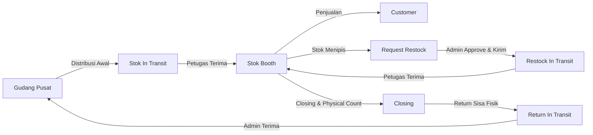
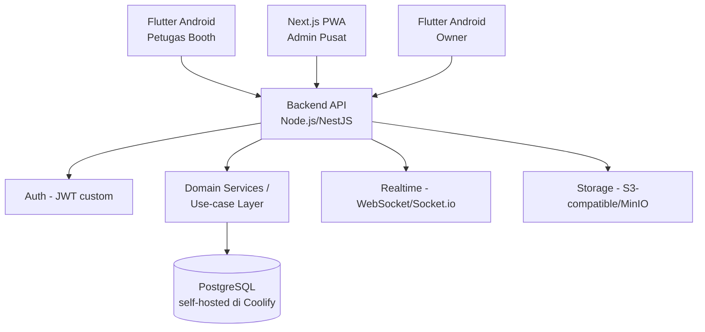
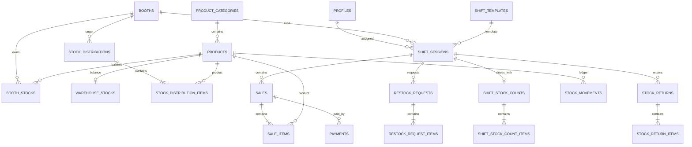
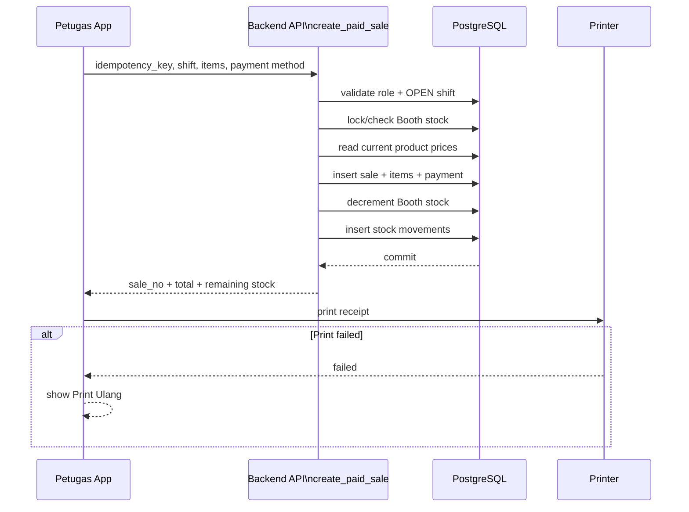
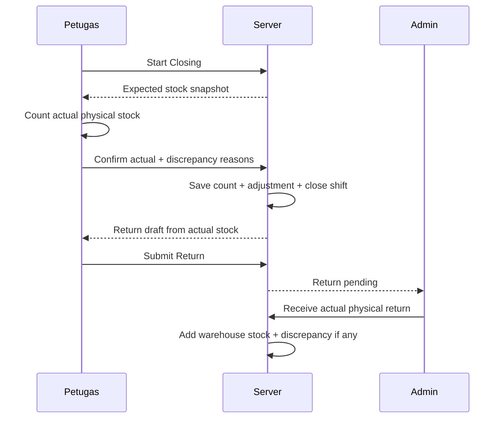
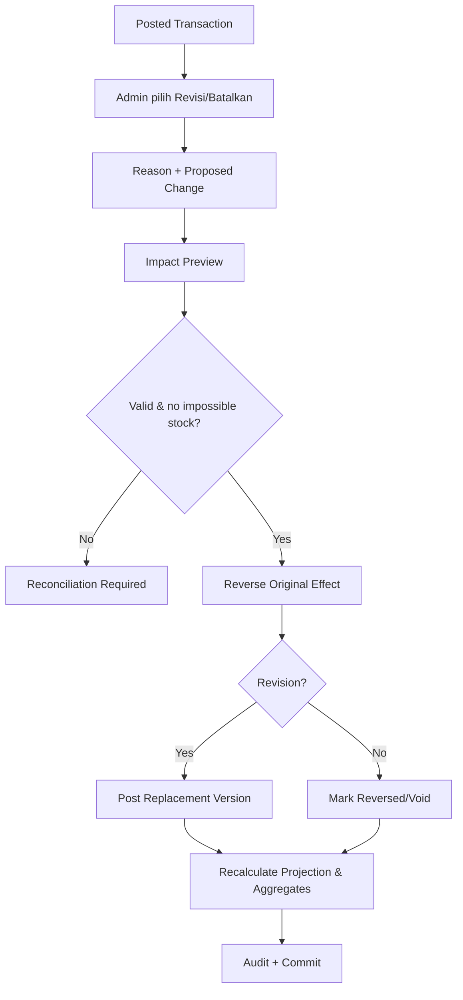
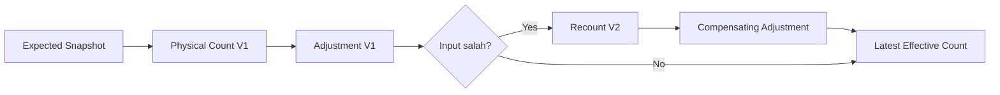

# 22 — Mermaid Diagrams

## 1. End-to-end stock flow

## 2. Application context

## 3. Core entity relationship overview

## 4. Sale transaction sequence

## 5. Closing sequence

## Correction flow

## Stock opname correction

